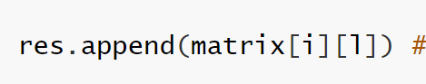

# 数组：

存储相同类型，也可以看作使用相同连续空间的线性表。

# 作业：

#### [66. 加一](https://leetcode-cn.com/problems/plus-one/)

```python
class Solution:
    def plusOne(self, digits: List[int]) -> List[int]:
        for i in range(len(digits)-1, -1, -1):
            if digits[i] == 9:  #应付数值为9时，返回为10的情况
                digits[i] = 0
            else:
                digits[i] = digits[i] + 1
                return digits
        return [1]+digits #应付数值为9时，返回为10的情况
    # 暴力解法，
```

#### [724. 寻找数组的中心下标](https://leetcode-cn.com/problems/find-pivot-index/)

[详解preSum，好的题解应该可以举一反三 - 寻找数组的中心下标 - 力扣（LeetCode） (leetcode-cn.com)](https://leetcode-cn.com/problems/find-pivot-index/solution/xiang-jie-presumhao-de-ti-jie-ying-gai-k-mzsg/)

```python
    def pivotIndex(self, nums: List[int]) -> int:
        sums = 0
        for x in nums:
            sums = sums + x
        
        temp = 0
        for i in range(len(nums)):
            
            if sums  == temp*2 + nums[i]:
                return i
            temp = nums[i] + temp
        return -1
    # 暴力解法
```

#### [189. 轮转数组](https://leetcode-cn.com/problems/rotate-array/)

[189. 轮转数组 题解 - 力扣（LeetCode） (leetcode-cn.com)](https://leetcode-cn.com/problems/rotate-array/solution/python3-san-chong-si-lu-189-by-lionking8-arbt/)

```python
class Solution:
    def rotate(self, nums: List[int], k: int) -> None:
        """
        Do not return anything, modify nums in-place instead.
        """
        retote = []
        k = k % len(nums)
        retote = nums[:len(nums)-k]
        for i in range(len(nums)-k):
            del nums[0]
        nums.extend(retote) # extend，扩展元素，把元素添加[123,1,2]；相对应append，追加一个新的元素[123,[1,2]]，即把新数组当作一个新元素。
```

**注意：**api的用法，extend，append。

#### [48. 旋转图像](https://leetcode-cn.com/problems/rotate-image/)

```python
class Solution:
    def rotate(self, matrix: List[List[int]]) -> None:
        """
        Do not return anything, modify matrix in-place instead.
        """   
    	n=len(matrix)
        # 翻转法
        for i in range(len(matrix)//2): # 水平
            for j in range(len(matrix)):
                matrix[i][j], matrix[n-i-1][j] = matrix[n-i-1][j], matrix[i][j] 
        for i in range(len(matrix)): #主对角线，选中了二维数组中的上半边翻
            for j in range(i):
                matrix[i][j], matrix[j][i] = matrix[j][i], matrix[i][j]
```

#### [54. 螺旋矩阵*](https://leetcode-cn.com/problems/spiral-matrix/)

```python
class Solution:
    def spiralOrder(self, matrix:[[int]]) -> [int]:
        if not matrix: return []
        l, r, t, b, res = 0, len(matrix[0]) - 1, 0, len(matrix) - 1, []
        while True:
            for i in range(l, r + 1): res.append(matrix[t][i]) # left to right
            t += 1
            if t > b: break
            for i in range(t, b + 1): res.append(matrix[i][r]) # top to bottom
            r -= 1
            if l > r: break
            for i in range(r, l - 1, -1): res.append(matrix[b][i]) # right to left
            b -= 1
            if t > b: break
            for i in range(b, t - 1, -1): res.append(matrix[i][l]) # bottom to top
            l += 1
            if l > r: break
        return res

链接：https://leetcode-cn.com/problems/shun-shi-zhen-da-yin-ju-zhen-lcof/solution/mian-shi-ti-29-shun-shi-zhen-da-yin-ju-zhen-she-di/

```

螺旋读数，边界的判断是重点，应用二维数组边界，指定l,r,t,b各自移动的判定条件，并且药细心注意添加到返回量res的x,y值，例：



千万别搞错。细节是魔鬼。

#### [498. 对角线遍历](https://leetcode-cn.com/problems/diagonal-traverse/)