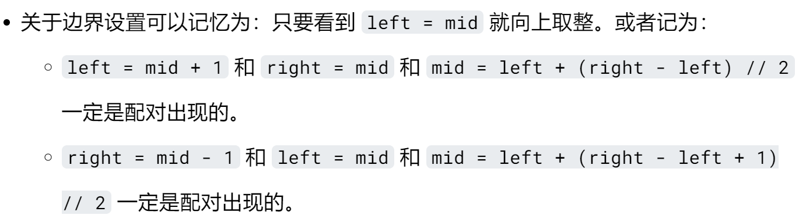

t其实在阅读二分查找知识部分的时候就能知道，这部分必然在排序算法之后讲解，二分查找理解起来很容易，但细节是魔鬼，实际做起来需要多加注意。提到的细节问题，

开闭的左闭右闭与我不谋而合；取值问题中mid=left+(right-left)+1//2**向上取整**既取右边的数拓宽了思路，自己刷很少这么写过；

用区间理解判断语句也是一样，也学到了如下的方法，减少了判断返回`left`和`right`了，有了上述细节问题的解决方法，在写代码时就方便很多，不像之前一样自己没整理过，只按自己刷过题的直觉来写。

```Python
# ...
    while left < right:
		# ...
	return left if nums[left] == target else -1
```

- 搜索区间范围的选择

```python
#1 找target存在的区间
def solution(self, nums, target):
	left = 0
    right = len(target)-1
    while left <= right:
        mid = left + (right - left) // 2
        if target = nums[mid]:
            return mid
        elif target > nums[mid]: #从右半区间查找，取右半边区间
            left = mid + 1
        else:
            right = mid - 1
    return -1
```

```python
#2 排除掉不存在的区间
def solution(self, nums, target):
	left = 0
    right = len(target)-1
    while left = right:
        mid = left + (right - left)+1//2
        if target < nums[mid]:#从左半边找，去掉右区间，且也不是nums[mid]则mid-1
            right = mid - 1
        else:
            left = mdi
        #或
        # if target > nums[mid]:
        #	 left = mid +1
        # else:
        #    right = mid
    return left if nums[mid]==target else -1
```



思路 1：因为判断语句是 `left <= right`，有时候要考虑返回是 `left` 还是 `right`。循环体内有 3 个分支，并且一定有一个分支用于退出循环或者直接返回。这种思路适合解决简单题目。即要查找的元素性质简单，**数组中都是非重复元素**，**且 `==`、`>`、`<` 的条件非常好写**的时候。

思路 2：更加符合二分查找算法的减治思想。每次排除目标元素一定不存在的区间，达到减少问题规模的效果。然后在可能存在的区间内继续查找目标元素。这种思路适合解决复杂题目。比如**查找一个数组里可能不存在的元素**，**找边界**问题，可以使用这种思路。