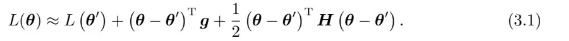
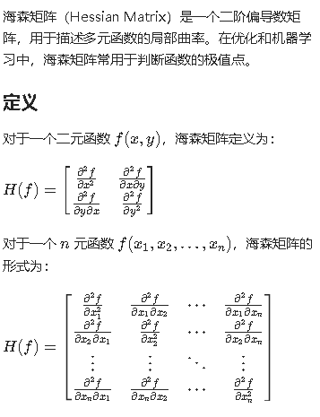

**Datawhale X 李宏毅苹果书 AI夏令营——1**

我们可以通过写出一组参数中某项记作$\theta'$附近的损失函数，判断临界值是局部极小值还是鞍点；

$\theta'$ 附近的$L(\theta)$可近似为：

第一项记作\theta和$theta'$比较近时候，第二项参数差*$\theta'$的梯度（一次微分），第三项参数差  $\theta'$的海森矩阵（二次微分）

注：hessian matrix:

那么，当处于critial point临界点的时候，第二项=0，第三项~=0，记作v=$\theta-\theta'$

当$v^tHv>0$，有local minima，H正定矩阵，特征值>0

当$v^tHv<0$，有local maxima，H负定矩阵，特征值<0

当情况不定，有saddle point 鞍点

Hessian矩阵还可以指出参数更新的方向：设$\lambda$为H的一个特征值$\lambda$，$\bold u$为其对应的特征向量。可令$\bold u = \theta - \theta'$，有：

$$\bold u^T\bold H \bold u = \bold u^T(\lambda\bold u) = \lambda||\bold u||^2 $$

例：若$\lambda < 0$， 则上式<0。所以$\frac 1 2 (\bold \theta - \bold \theta')^T\bold H (\bold \theta - \bold \theta')<0$。此时,$L(\theta)<L(\theta')$，且，$$\theta = \theta'+\bold u$$，沿着$\bold u $的方向更新$\theta$，L就会变小。

即找到一个负的特征值，再找出相应的特征向量$+ \theta'$，就可以找到一个损失L更低的点。