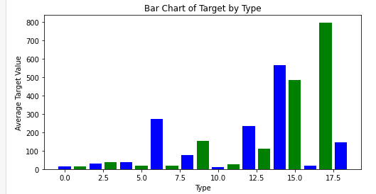
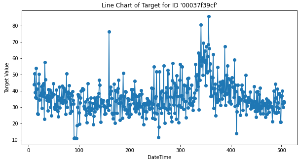
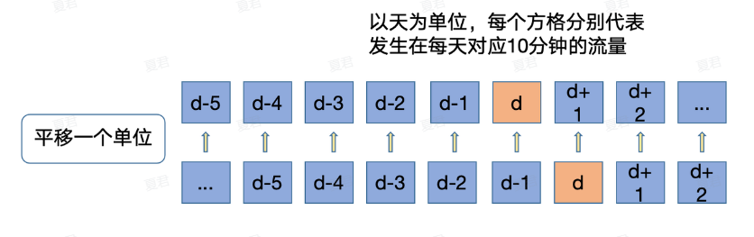
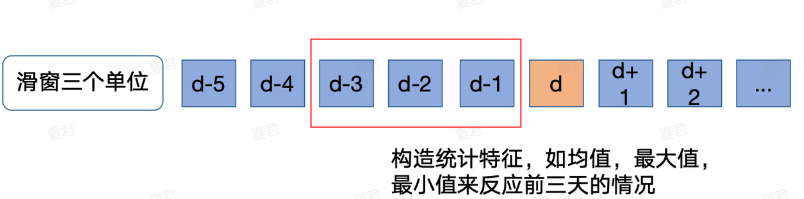

# Datawhale AI夏令营——电力需求预测挑战赛

## 本赛题为时间序列问题，先EDA

> **数据简单介绍：**
>
> - 其中id为房屋id，
> - dt为日标识，训练数据dt最小为11，预测数据最小为1，不同id对应序列长度不同；
> - type为房屋类型，通常而言不同类型的房屋整体消耗存在比较大的差异；
> - target为实际电力消耗，也是我们的本次比赛的预测目标。

对type与avg(target)做柱状图，可以发现某些type的电量消耗是有明显差异的，与target有一定的相关性

```Python
import matplotlib.pyplot as plt
# 不同type类型对应target的柱状图
type_target_df = train.groupby('type')['target'].mean().reset_index()
plt.figure(figsize=(8, 4))
plt.bar(type_target_df['type'], type_target_df['target'], color=['blue', 'green'])
plt.xlabel('Type')
plt.ylabel('Average Target Value')
plt.title('Bar Chart of Target by Type')
plt.show()
```



dt对应target的散点图，分布还是可以的

```python
specific_id_df = train[train['id'] == '00037f39cf']
plt.figure(figsize=(10, 5))
plt.plot(specific_id_df['dt'], specific_id_df['target'], marker='o', linestyle='-')
plt.xlabel('DateTime')
plt.ylabel('Target Value')
plt.title("Line Chart of Target for ID '00037f39cf'")
plt.show()
```




## 特征工程

直播中讲解了两种方法：

1. 历史平移特征：要计算某单位时间d的数据，要把d-1的数据给到d时刻，以此类推，相当于把历史时刻的特征都平移一个单位

   

2. 窗口统计特征：构建需要的时间窗口大小，然后基于窗口范围进统计均值、最大值、最小值、中位数、方差的信息，可以反映最近阶段数据的变化情况

   

   根据观察时间序列特征，不难发现，具有一定的周期性与趋势性特点，并具有少量异常点等等可处理和可挖掘的提升点，并且可以尝试多种模型来训练不同特征并融合来提升最终模型的泛化能力。

