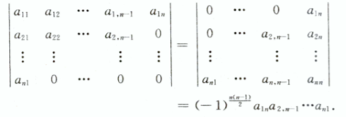
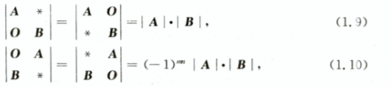
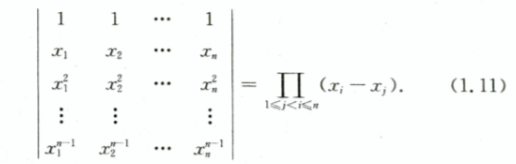
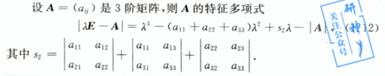
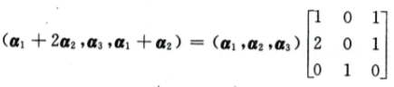
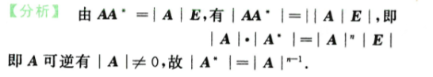

# 2-行列式

> 知识结构网络图

- 概念：不同行不同列元素乘积的代数和
  - 对于二、三行列式有对角线法则，对于三以上行列式不适用
- 性质（不要记忆，了解推导的过程，知道推导过程的核心就行）
  1. |AT|=|A|
  2. **某行**有公因数k，可以k提到行列式外。
  3. 两行互换行列式变号（根据行列式的定义而来），特别地，两行相等，行列式为0
  4. 某行所有元素都是两个数的和，可以进行拆分，则可以写成两个行列式之和
     - 注意这里是某行
     - 书中有特意说明，需要注意一下
  5. 某行的k倍加到另一行，行列式值不变
- 展开式（代数余子式）—— 参考网络

> 基础知识

n阶行列式是所有取不同行不同列的n个元素的乘积的代数和，至于是符号问题，需要参考该项前面的**排列奇偶问题**。这里引入逆序数概念，比如排序25134中，第一个2只比后面的1大，所以第一项为1，第二为3，依此类推，其逆序数为4,是偶排序。

> 重要定理

|A|等于它任意一行所有元素与它们对应代数余子式之和,按照某列展开页称之为按k列展开公式。

根据代数余子式的相关概念，我们可以根据矩阵A和行列式|A|

Undefined control sequence \a

即 $$ AA^*=A^*A=|A|E $$ $A*$这里叫做伴随矩阵

> 主要公式

1. 上（下）三角行列式的值等于主对角线元素的乘积

2. 副对角线行列式为

   

3. 两个特殊的拉普拉斯展开式

   

[A0 CB ]=[A0 0I ][I0 0I ][I0 0B ]=|A||E||B|=|A||B|

1. 范德蒙行列式

最好写成三角表示，更好理解

1. 特征多项式

   

Undefined control sequence \A

> 方阵的行列式

1. |AT|=|A|

2. |kA|=kn|A|

3. |AB|=|A||B|

4. |A∗|=|A|n−1

5. A−1=|A|−1

6. 如果矩阵A与矩阵B相似，则

   |A|=|B|

   - 相似的意思 TAT−1=B

7. 如果A是n阶矩阵，λi是A的特征值，则|A|为所有特征值之积

> 课本做题技巧

- 观察行列式的规则，是否进行消元处理，行列式是否是爪形，对象行等
- 基本定理的使用

> 题目

群公告 Task01：行列式（2天） 截止时间 10月13日03:00

作业： 填空题 求行列式：276、277、278、279、280、281、282、283、284、285、286； 选择题 行列式的计算：341、342、343、344、345、346、347、348、349；

视频课程： 线性代数https://www.bilibili.com/video/BV15L4y167JE

> 练习册题目

填空题：

`276-281` 这类题目主要是观察行列式的内容，然后进行变换即可。比如行与行的倍数相加，列也是如此；是否是爪形行列式，是否可以变换得到拉普拉斯，或者是否满足范德蒙

`282-284` 属于 |kA+xB 的变换，这里题目的话，不太熟练，特别是284题目。重点没有掌握好AT、A∗、A−1之间的联系，对于矩阵的性质不太熟悉

`285-286` 特征值、特征向量的计算，**相似矩阵**的概念和之间的变换

感悟：需要熟悉定义，了解相关的技巧

选择题：

`341-345` 行列变换、主副对角矩阵

这种表示是一种精髓

`346-349` 347 中不太理解这里：

？ A为n方阵,|kA|=kn|A|

> 学习·技巧·总结

- 可以先把教材版本先过一遍习题，后面再针对性做题，这样可以直接学以致用，高效学习
- 行列式的大小容易和矩阵的大小混淆，对于逆矩阵、转置矩阵、n阶方阵的性质有待加强
- 个人基础不太好，学了整整6个小时才做完。哭了
- 了解定义，总结技巧