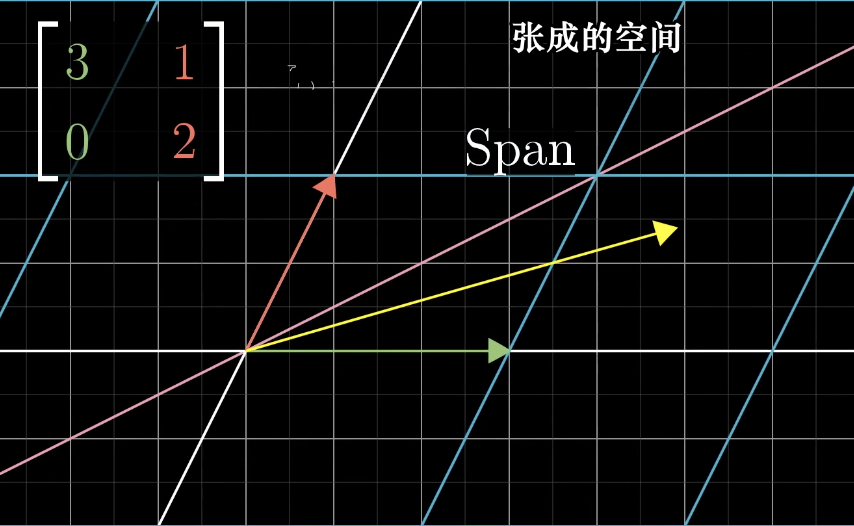
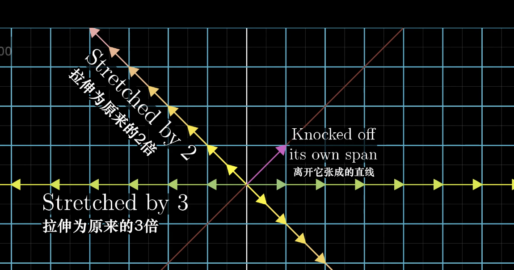
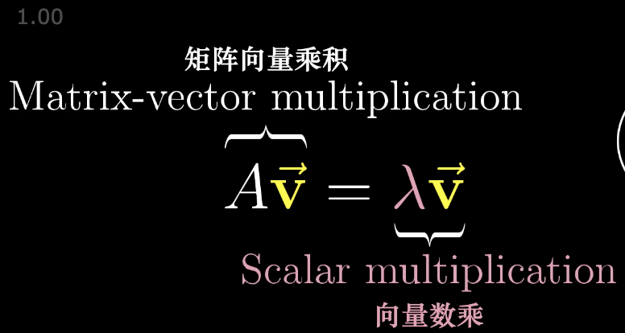
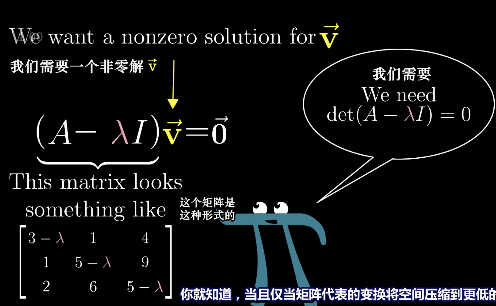
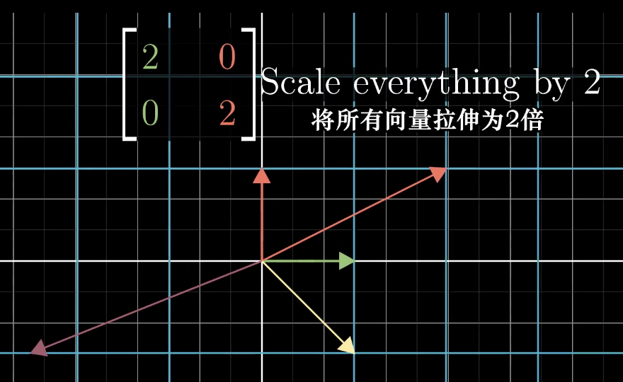
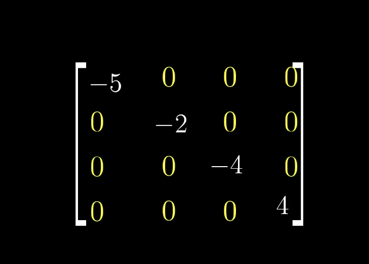
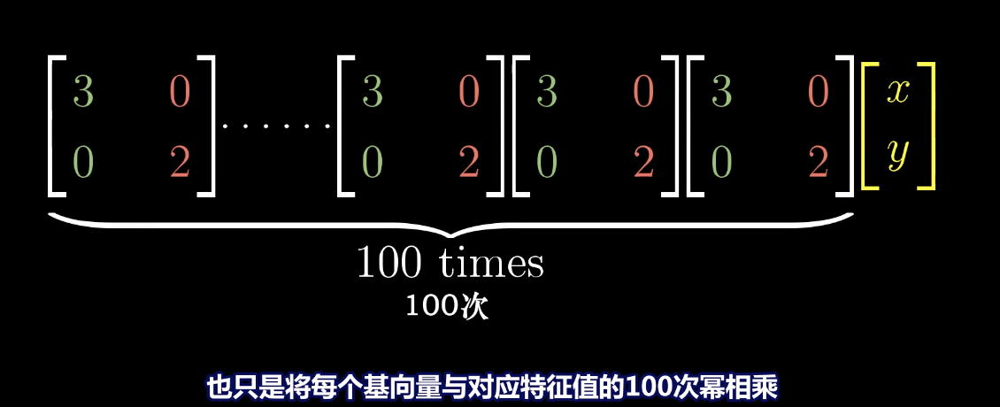
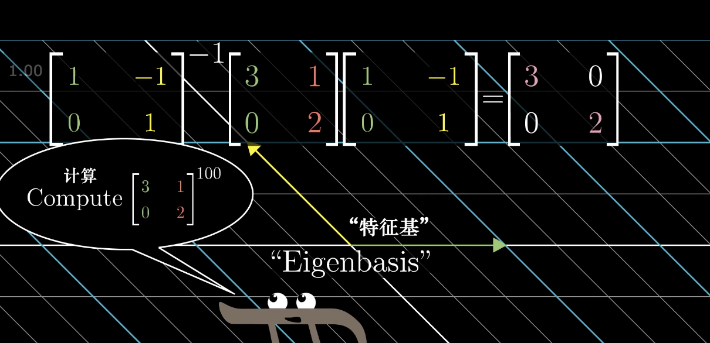
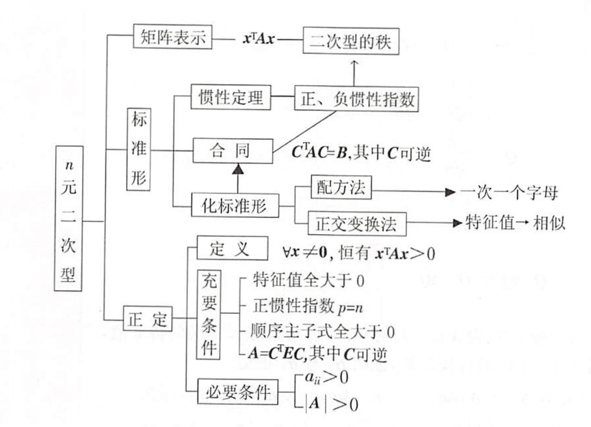

## 特征值和特征向量

我们先来看一个线性变换的矩阵，并且考虑他所张成的空间，也就是过原点和向量尖端的直线：

在这个变换中，绝大部分的向量都已经离开了它们张成的空间，但是某些特殊向量的确留在它们张成的空间里，意味着矩阵对他的作用只是拉伸或者压缩而已，如同一个标量。

如果一个向量留在它们张成的空间里，例如下面的 两个向量，就是它们的特征向量，而被拉伸或者压缩的倍数就是特征值。

那么特征值和特征向量有什么用呢？

例如我们考虑一个 3-D 空间的旋转，如果能够找到这个旋转的特征向量，它们所在的直线就是旋转轴（在这种情况下，特征值必须为1 ，因为不改变长度）。

特征向量的计算方法：

而这个等式的目的在于寻找一个 lambda，把它当作一个线性变换，也就是将调整变换后的空间压缩到一个更低的维度上。

当然一个线性变换也可能没有特征向量，例如一个90度的旋转，所有的向量都已经改变了，但是如果我们求解上面的方程，会得到两个复数解，没有实数解，就代表没有特征向量。

而且属于单个特征值可能有多个特征向量，例如下面这个矩阵：

除了对角元以外的其他元素都为 0 的矩阵被称为对角矩阵。

对于对角矩阵，它们对角线上的值就是特征值，它们列向量就是特征向量了。

同时，对角矩阵对于矩阵的多次计算非常有用，例如在矩阵多次与自己相乘的结果上更容易计算：

同时，特征基（能够张成全空间的一组特征向量对应的特征值）也会在运算中起到非常大的作用。

## 二次型

二次型和特征值特征向量联系很大。

由n元二次型入手，转换为矩阵表达式：

