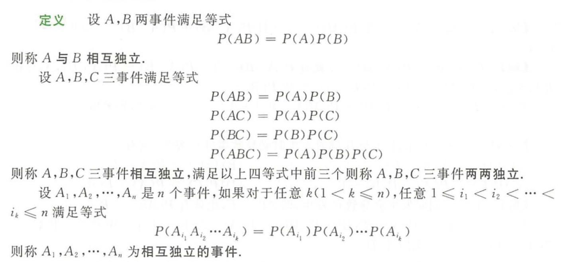

## 随机试验、随机事件、样本空间

**定义：**

$B\supset A或A\subset B$：B 包含事件A/A包含于事件B，A必然导致B发生。

**图例：**

**运算定律：**

## 概率

概率定义/性质、条件概率：略

**事件的独立性：**

**性质：**

**五大概率公式：**

1. 加法公式：

2. 减法公式：

3. 乘法公式：

4. 全概率公式：

5. 贝叶斯公式：

