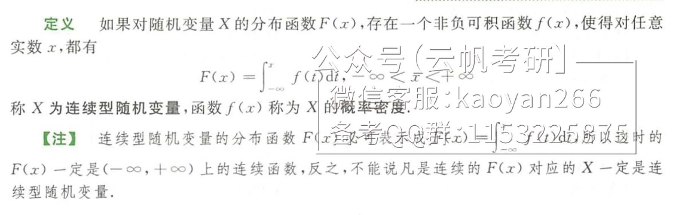

# 随机变量及概略分布

## 随机变量及其分布函数

**分布函数性质：**

**概率密度：**

**概率密度函数的性质：**

## 常用分布

1. 0-1分布
2. 二项分布
3. 几何分布
4. 超几何分布
5. 泊松分布
   - 泊松定理
6. 均匀分布
7. 指数分布
8. 正态分布

## 随机变量函数的分布

设X是一个随机变量，则它的函数Y=g(X)也是随机变量。

当X是离散型随机变量时，设X的分布律为P{X=x_k}=p_k,k=1,2,...，显然Y也是离散型随机变量，气氛步履为P{Y=g(x_k)}=pk,k=1,2,...，如果在g(x_k)中有相同的数值，则将他们相应的概率何作为Y取值的概率。

当X是连续型随机变量时，设X的概率密度函数为f_x(x)，显然一般Y也是连续型随机变量，记其概率密度为f_Y(y)，则常用两种方法来计算：

