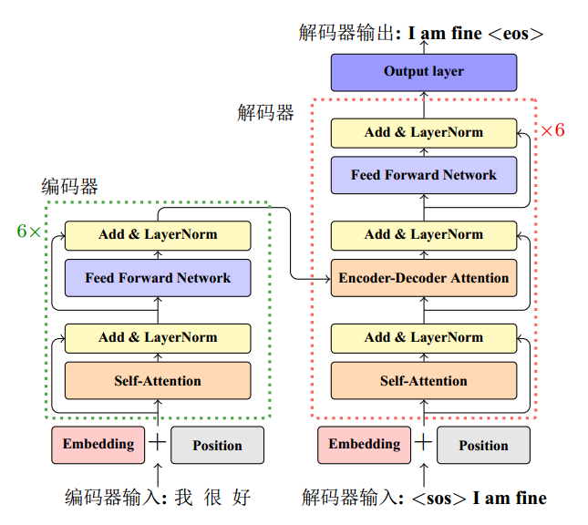
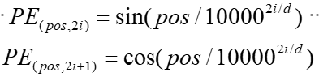
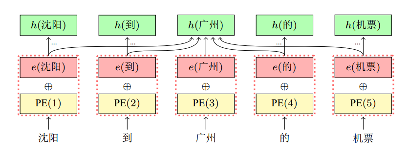

t3使用transformer模型

##  Transformer 模型的基本架构:

 

从宏观角度来看，Transformer的编码器是由多个相同的层叠加而成的，每个层都有两个子层（子层表示为sublayer）。第⼀个子层是**多头自注意力（multi-head self-attention）汇聚**；第二个子层是**基于位置的前馈网络（positionwise feed-forward network）**。主要涉及到如下几个模块：

### **1. 嵌入表示层**   

对于输入文本序列，先通过一个输入嵌入层（Input Embedding）**将每个单词转换为其相对应的向量表示**。通常直接对每个单词创建一个向量表示。由于 Transfomer 模型不再使用基于循环的方式建模文本输入，序列中不再有任何信息能够提示模型单词之间的相对位置关系。在送入编码器端建模其上下文语义之前，一个非常重要的操作是**在词嵌入中加入位置编码（Positional Encoding）这一特征**。具体来说，序列中每一个单词所在的位置都对应一个向量。这一向量会与单词表示对应相加并送入到后续模块中做进一步处理。在训练的过程当中，模型会自动地学习到如何利用这部分位置信息。为了得到不同位置对应的编码，Transformer 模型使用**不同频率的正余弦函数**如下所示：

其中，$$pos$$ 表示单词所在的位置，$$2i$$ 和 $$2i+1$$ 表示位置编码向量中的对应维度，$$d$$则对应位置编码的总维度。

通过上面这种方式计算位置编码有这样几个好处：

- 首先，正余弦函数的范围是在 $$[-1,+1]$$，导出的**位置编码与原词嵌入相加不会使得结果偏离过远而破坏原有单词的语义信息**。
- 其次，依据三角函数的基本性质，可以得知**第**$$pos+k$$ **个位置的编码是第** $$pos$$ **个位置的编码的线性组合，这就意味着位置编码中蕴含着单词之间的距离信息**。

位置编码的维度和词嵌入向量的维度相同（ 均为 d_model），模型通过将二者相加作为模型输入

### **2. 注意力层**

**自注意力（Self-Attention）**操作是基于 Transformer 的机器翻译模型的基本操作，在源语言的编码和目标语言的生成中频繁地被使用以建模源语言、目标语言任意两个单词之间的依赖关系。给定由单词语义嵌入及其位置编码叠加得到的输入表示 $$\{x_{i} \in R^{d}\}_{i=1}^{t}$$，为了实现对上下文语义依赖的建模，进一步引入在自注意力机制中涉及到的三个元素：**查询** $$q_{i}（Query）$$ **，键** $$k_{i}（Key）$$ **，值** $$v_{i}（Value）$$ 。在编码输入序列中每一个单词的表示的过程中，这三个元素用于计算上下文单词所对应的权重得分。直观地说，这些**权重反映了在编码当前单词的表示时，对于上下文不同部分所需要的关注程度**。

为了得到编码单词 $$x_{i}$$ 时所需要关注的上下文信息，通过位置 $$i$$ 查询向量与其他位置的键向量做点积得到匹配分数 $$q_{i}\cdot k_{1},q_{i}\cdot k_{2},...,q_{i}\cdot k_{t}$$ 。**为了防止过大的匹配分数在后续 Softmax 计算过程中导致的梯度爆炸以及收敛效率差的问题**，这些得分会除放缩因子 $$\sqrt{d} $$ 以稳定优化。放缩后的得分经过 Softmax 归一化为概率之后，与其他位置的值向量相乘来聚合希望关注的上下文信息，并最小化不相关信息的干扰。上述计算过程可以被形式化地表述如下：

 $$Z=Attention(Q,K,V)=Softmax(\frac{QK^{T}}{\sqrt{d}})V$$

其中 $$Q \in R^{L\times d_{q}}$$, $$K \in R^{L\times d_{k}}$$, $$V \in R^{L\times d_{v}}$$分别表示输入序列中的不同单词的  $$q,k,v$$向量拼接组成的矩阵，L 表示序列长度， $$Z \in R^{L\times d_{v}}$$表示自注意力操作的输出。

### **3. 前馈层**

前馈层接受自注意力子层的输出作为输入，并通过一个带有 Relu 激活函数的两层全连接网络对输入进行更加复杂的**非线性变换**。实验证明，这一非线性变换会对模型最终的性能产生十分重要的影响。

​                           

$$FFN(x)=Relu(xW_{1}+b_{1})W_{2}+b_{2}$$

其中 $$W_{1},b_{1},W_{2},b_{2}$$ 表示前馈子层的参数。另外，以往的训练发现，**增大前馈子层隐状态的维度有利于提升最终翻译结果的质量，因此，前馈子层隐状态的维度一般比自注意力子层要大**。

### **4. 残差连接与层归一化**

由 Transformer 结构组成的网络结构通常都是非常庞大。编码器和解码器均由很多层基本的Transformer 块组成，每一层当中都包含复杂的非线性映射，这就导致模型的训练比较困难。因此，研究者们在 Transformer 块中进一步引入了残差连接与层归一化技术以进一步提升训练的稳定性。具体来说，**残差连接**主要是指使用一条直连通道直接将对应子层的输入连接到输出上去，从而**避免由于网络过深在优化过程中潜在的梯度消失问题**：

​                                                                                               

$$x^{l+1}=f(x^l)+x^l$$

其中 $$x^l$$ 表示第 $$l$$ 层的输入，$$f(\cdot)$$表示一个映射函数。此外，为了进一步使得每一层的输入输出范围稳定在一个合理的范围内，**层归一化**技术被进一步引入每个 Transformer 块的当中：

​                                                  

​                                            $$LN(x)=\alpha \cdot \frac{x-\mu}{\sigma} + b$$

其中 $$\mu$$  和 $$\sigma$$ 分别表示均值和方差，用于将数据平移缩放到均值为 0，方差为 1 的标准分布， $$a$$  和  $$b$$ 是可学习的参数。层归一化技术可以**有效地缓解优化过程中潜在的不稳定、收敛速度慢等问题**。

### **5. 编码器和解码器结构**

根据给出的网络架构，编码器端可以较为容易实现。但相比于编码器端，解码器端要更复杂一些。具体来说，解码器的每个 Transformer 块的第一个自注意力子层额外增加了注意力掩码，对应图中的掩码多头注意力（Masked Multi-Head Attention）部分。这主要是因为在翻译的过程中，编码器端主要用于编码源语言序列的信息，而这个序列是完全已知的，因而编码器仅需要考虑如何融合上下文语义信息即可。而解码端则负责生成目标语言序列，这一生成过程是**自回归**的，即对于每一个单词的生成过程，仅有当前单词之前的目标语言序列是可以被观测的，因此这一额外**增加的掩码是用来掩盖后续的文本信息，以防模型在训练阶段直接看到后续的文本序列进而无法得到有效地训练**。

此外，解码器端还额外增加了一个**多头注意力（Multi-Head Attention）模块**，使用交叉注意力（Cross-attention）方法，同时接收来自编码器端的输出以及当前 Transformer 块的前一个掩码注意力层的输出。查询是通过解码器前一层的输出进行投影的，而键和值是使用编码器的输出进行投影的。它的作用是在翻译的过程当中，为了生成合理的目标语言序列需要观测待翻译的源语言序列是什么。基于上述的编码器和解码器结构，待翻译的源语言文本，先经过编码器端的每个Transformer 块对其上下文语义的层层抽象，然后输出每一个源语言单词上下文相关的表示。解码器端以自回归的方式生成目标语言文本，即在每个时间步 t ，根据编码器端输出的源语言文本表示，以及前 t-1 个时刻生成的目标语言文本，生成当前时刻的目标语言单词。

## 上分技巧

1. **调参**：通过增加训练的epochs、使用全部训练集以及调整模型参数（如head、layers等），可以提高模型的表达能力和翻译质量。如果数据量允许，增加模型的深度（更多的编码器/解码器层）或宽度（更大的隐藏层尺寸）也是一个有效的方法 。

2. **加入术语词典**：在翻译输出中替换术语、整合到数据预处理流程或在模型内部动态调整术语的嵌入，这些方法可以确保术语的一致性并提高翻译质量。

3. **数据清洗**：认真进行数据清洗，因为脏数据会影响模型训练的效果 。

4. **数据扩增**：使用回译、同义词替换、句法分析和语义解析技术重新表述句子，以及将文本翻译成多种语言后再翻译回原语言，来获得更多样化的训练数据。

5. **学习率调度策略**：采用Noam Scheduler、Step Decay或Cosine Annealing等更精细的学习率调度策略，代替固定的学习率，以优化训练过程。

6. **训练小的预训练模型**：选择1B参数以下的小模型进行训练，需要较高的GPU资源。

7. **Finetune**：将训练集上训练出的模型在开发集上进行微调，以提高测试集的得分，因为开发集与测试集的分布相近。

8. **集成学习**：训练多个不同初始化或架构的模型，并使用集成方法来产生最终翻译，这有助于减少过拟合并提高翻译的稳定性。

9. **模型评估**：在开发集和测试集上训练语言模型，用该模型给训练集中的句子打分，选出高分句子以优化训练数据。

这些策略可以根据具体情况和资源的可用性进行选择和调整，