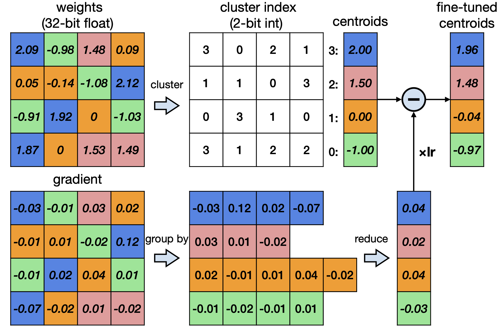
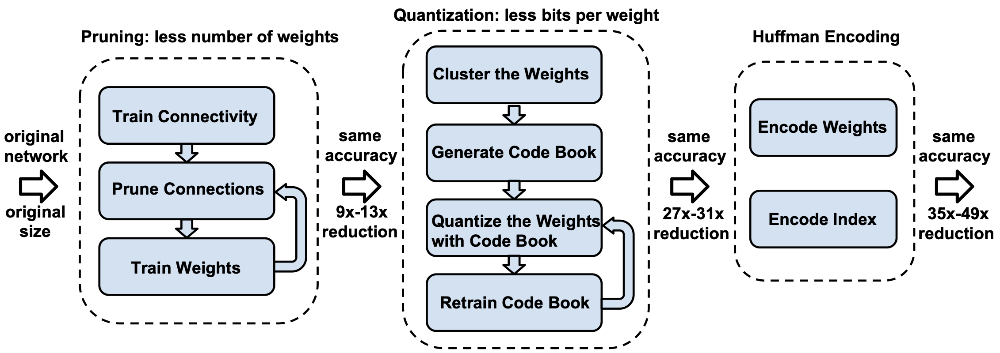
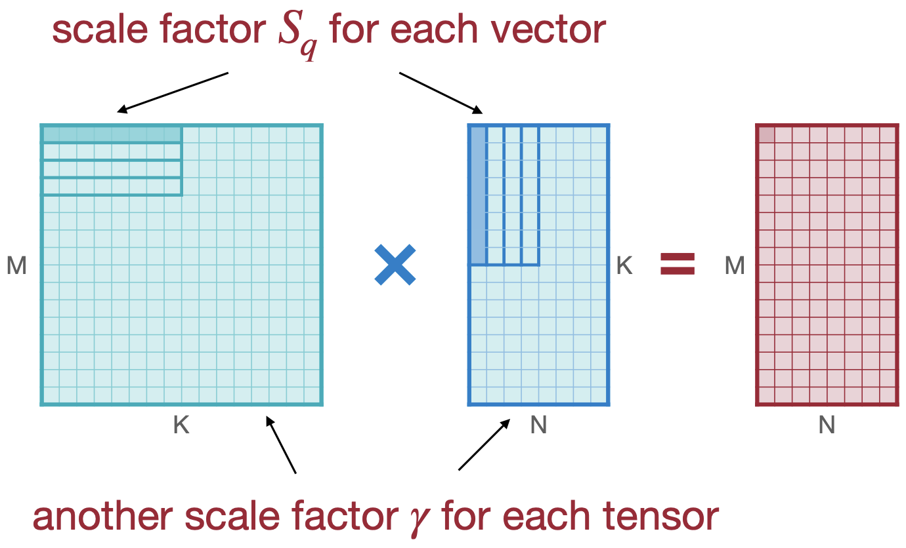

# datawhale 11 月组队学习 模型减肥秘籍——模型量化

> datawhale课程链接：[模型减肥秘籍：模型压缩技术-课程详情 | Datawhale](https://www.datawhale.cn/learn/content/68/960)

[TOC]

## 数据类型：

1. **整型（Integer）**：
   - 整型数据分为无符号整型和有符号整型。
     - **无符号整型**：数据范围为 0 到$2^n - 1$。
     - **有符号整型**：使用补码表示，数据范围为$-2^{n-1}$到$2^{n-1} - 1$。

2. **定点数（Fixed Point Number）**：
   - 定点数的特点是小数点位置固定，适合表示小数数据。定点数由符号位、整数位和小数位组成，能够在一定范围内提供较高的精度。

3. **浮点数（Floating Point Number）**：
   - 浮点数采用科学计数法表示，包含符号位、指数部分和尾数部分。常见的浮点数格式包括：
     - FP32：32位浮点数，具有较大的表示范围和精度。
     - FP16、BF16、FP8等：这些格式在精度和范围上有所不同，适用于不同的应用场景。
   - 浮点数的表示方式包括正规浮点数和非正规浮点数，后者用于表示接近零的数值。

4. **定点数与浮点数的比较**：
   - 在相同位数下，浮点数的表示范围大于定点数，且相对精度更高。然而，浮点运算浮点数在计算时需要同时计算指数和尾数，并且需要对结果进行归一化，计算速度较慢。

## 基本的方法

### k-means量化

1. **聚类过程**：

   - k-means 量化将权重（weights）聚类成多个类别（举例4类），每个权重只需存储其对应的聚类索引值。就可以实现2-bit的压缩。 存储占用从 `32bit x 16 = 512 bit = 64 B => 2bit x 16 + 32 bit x 4 = 32 bit + 128 bit = 160 bit = 20 B`

2. **存储与计算**：

   - 存储方式为整型权重加上浮点型的转换表。具体来说，权重的实际值通过索引查找转换表来获取，从而减少存储需求。

3. **压缩效果**：
   - 通过聚类，存储占用从原来的 32 位浮点数压缩到更小的位数。例如，将 32 位的权重压缩到 2 位的索引值，加上少量的浮点数转换表，可以显著减少模型的存储大小。

4. **量化过程**：

   

   

   - 在推理时，模型读取转换表，根据索引值获取对应的权重值进行计算。

   - 在训练时，梯度按照权重的聚类方式进行聚类相加，并反向传播到转换表，以更新转换表的值。

5. **结合剪枝**：

   - k-means 量化结合剪枝，首先对模型进行微调、剪枝，然后对剪枝后的参数进行 k-means 聚类，再使用哈夫曼表进一步压缩模型。

     

### 线型量化

线性量化是将原始浮点数据与量化后的定点数据之间建立简单的线性变换关系的方法。可应用于卷积和全连接等网络层的计算，允许直接使用量化后的数据进行计算。

1. **基本定义**：

   - 线性量化通过一个缩放因子（S）和一个偏移量（Z）将浮点数（r）转换为定点整数（q）。转换公式为：
   $$
     q = \text{round}\left(\frac{r}{S} + Z\right)
   $$
   - 其中，S表示浮点数和整数之间的比例关系，Z是量化偏移量。

2. **量化类型**：
   - 根据量化偏移量线性量化可以分为对称量化（Z=0）和非对称量化（Z≠0）。大多数情况下，量化使用无符号整数（如INT8[0, 255]）。

3. **计算S和Z**：

   - S和Z的计算方法如下：
    $$S = \frac{r_{\text{max}} - r_{\text{min}}}{q_{\text{max}} - q_{\text{min}}}$$
     $$Z = \text{round}\left(q_{\text{max}} - \frac{r_{\text{max}}}{S}\right)$$
   - 其中，$r_\text{max}$和$r_{min}$是浮点数的最大和最小值，$q_{\text{max}}$和$q_{\text{min}}$是定点数的最大和最小值。

4. **绝对最大量化（AbsMax）**：
   - 另一种常见的线性量化方法是绝对最大量化，其公式为：
    $X_{\text{quant}} = \text{round}(S \cdot X)$
   - 其中，S的计算方式为：
   $$
     S = \frac{2^{n-1}-1}{\max |X|}
   $$
   - 反量化公式为：
   $$
     X_{\text{dequant}} = \text{round}\left(\frac{X_{\text{quant}}}{S}\right)
   $$

   

5. **线性矩阵乘法量化**：

   线性矩阵乘量化将线性量化应用于矩阵乘法。假设有两个量化后的矩阵$q_W$和$q_X$，其对应的缩放因子和零点分别为$S_W, Z_W$和$S_X, Z_X$。矩阵乘法的公式可以表示为：

$$
S_Y(q_Y - Z_Y) = S_W(q_W - Z_W) \cdot S_X(q_X - Z_X)
$$
   通过整理，可以得到量化输出$q_Y$的公式：

$$
   q_Y = \frac{S_W S_X}{S_Y}(q_W q_X - Z_W q_X - Z_X q_W + Z_W Z_X) + Z_Y
$$
   在此过程中，量化的零点$Z_W$可以设为 0，以简化计算，采用对称线性量化。此时，缩放因子的计算公式为：

$$
   S = \frac{|r|_{max}}{2^{N-1}}
$$
   其中$N$是定点数的小数位数。

6. **全连接层线性量化**

   全连接层的线性量化与矩阵乘法类似，但需要考虑偏置项。对称量化的公式为：

$$
   S_Y(q_Y - Z_Y) = S_W S_X(q_W q_X - Z_X q_W) + S_b(q_b - Z_b)
$$
   在此公式中，$S_b$是偏置的缩放因子。通常情况下，可以将$Z_b$设为 0，从而简化公式为：

$$
   q_Y = \frac{S_W S_X}{S_Y}(q_W q_X - Z_X q_W + q_b) + Z_Y
$$

7. **卷积层线性量化**

   卷积层的线性量化与全连接层类似，但需要处理卷积核。量化公式为：

$$
   q_Y = \frac{S_W S_X}{S_Y}(\text{Conv}(q_W, q_X) - \text{Conv}(Z_X, q_W) + q_b) + Z_Y
$$
   在这个公式中，卷积操作的量化输出通过量化的权重和输入进行计算，并加上偏置项。量化的激活和权重通过卷积操作结合，最终得到量化结果。

## 训练后量化（Post-Training Quantization）

训练后量化是在模型训练完成后对其进行量化的过程，也称为离线量化。

1. **量化类型**：
   - 根据量化零点(偏移量Z)是否为0，训练后量化分为对称量化和非对称量化。
   - 根据量化粒度，训练后量化可分为逐张量量化、逐通道量化和组量化。

2. **量化粒度**：

   正确的粒度有助于最大化量化，而不会大幅降低准确性性能

   1. **逐张量量化（Per-Tensor Quantization）**：对每一层进行量化，所有元素共享相同的量化参数。这种方法可能导致精度下降，因为不同张量的参数值范围可能不同，所以当层级效果不好时要对channel级进行量化。

   2. **逐通道量化（Channel-wise Quantization）**：对每个通道的数据进行单独量化，可以减少量化误差，但需要更多的存储空间。

   3. **组量化（Group Quantization）**：将通道内的数据拆分成多组向量，每组共享一个量化参数，结合了不同粒度的缩放因子，以平衡精度和硬件效率。

      $$VS-Quant:r = S(q - Z) \rightarrow r = \gamma \cdot S_q(q - Z)$$

      - $\gamma$是浮点数的粗粒度缩放因子，$S_q$是每个向量的整数缩放因子

      - 较小粒度时，使用较简单的整数缩放因子；较大粒度时，使用较复杂的浮点缩放因子

      - 存储开销：对于两级缩放因子，假设使用4-bit的量化，每16个元素有一个4-bit的向量缩放因子，那么有效位宽为 `4+4/16=4.25`bits

        

        

3. **量化误差**：

   - 量化通常会导致模型精度下降，量化误差主要来自两个方面：clip操作和round操作。选择合适的量化参数（如缩放因子和零点）可以尽量减少对准确率的影响。

4. **动态量化参数的计算 cliping**：

   动态量化参数的计算（Clipping）主要关注如何在量化过程中选择合适的参数，以减少量化对模型精度的影响。该小节的关键内容包括：

   - **动态量化的目的**：
     - 动态量化旨在通过合理选择量化参数（如缩放因子和零点）来降低量化带来的精度损失。

   - **量化误差来源**：

     量化误差主要来自两方面：clip操作和round操作。Clip操作是将数据限制在特定范围内，而round操作则是将浮点数映射到整数。

   - **动态量化参数的计算方法**：

      - **指数移动平均（EMA）**：
        
        - EMA用于平滑处理训练过程中激活函数的取值范围，通过公式：
          $$
          r^{t+1}_{min,max} = \alpha r^{t}_{min,max} + (1 - \alpha) r^{t+1}_{min,max}
          $$
        - 其中，$\alpha $是平滑系数。
        
      - **Min-Max 校准**：
        
        - 通过在训练好的fp32模型上运行少量校准数据，统计校准数据的取值范围 $r_{min,max} $，并取平均值作为量化参数。
        
      - **KL 量化**：
        
        - 使用KL散度衡量数据和量化后数据之间的相似性，寻找合适的阈值 $|T| < \max(|\text{max}|, |\text{min}|)$，将数据映射到量化范围如$[-127, 128]$，只要阈值选择得当使得两个数据分布相似就不会对精度损失造成影响。
        
          $D_{KL}(P \| Q) = \sum_{i=1}^{n} P(x_i) \log \frac{P(x_i)}{Q(x_i)}$
        
      - **均方误差（MSE）**：
        
        - 通过最小化输入数据$x$和量化后数据$Q(x)$之间的均方误差，动态调整$|r|_{max} $来计算最合适的量化参数。
        
          $\min_{|r|_{max}} E((X - Q(X))^2)$

5. **舍入（Rounding）**：

   - 舍入操作将浮点数映射到整数，常用的舍入方法是最近整数（Rounding-to-nearest）。为了减少量化误差，可以通过评估舍入对输出的影响来决定权重的舍入方式，采用自适应舍入（AdaRound）方法。

     $\text{argmin} \| W x - \hat{W} x \|$

     其中：$\hat{W} = |W| + \sigma, \; \sigma \in [0, 1]$，表示当前值是向上还是向下取整。

## 量化感知训练（Quantization-Aware Training)

量化感知训练（QAT）是一种对模型添加模拟量化算子，模拟量化模型在推理阶段的舍入和裁剪操作，引入量化误差。并通过反向传播更新模型参数，使得模型在量化后和量化前保持一致。

1. **定义**：
   - QAT通过在训练过程中添加模拟量化算子，模拟推理阶段的舍入和裁剪操作，引入量化误差，从而使模型在量化后的表现与未量化时尽可能一致。

2. **前向传播**：
   - 在前向传播中，Layer\(_{N-1}\) 的输出 \(Q(X)\) 作为输入传入到下一层 Layer\(_N\)。每层的权重 \(W\) 经过量化反量化后得到 \(Q(W)\)，并与 \(Q(X)\) 计算得到输出 \(Y\)。最终，输出 \(Y\) 经过量化反量化得到 \(Q(Y)\)，作为下一层的输入。

3. **量化误差**：
   - 由于 int8 的表示范围远小于 fp32，当 fp32 量化成 int8 时，不同大小的数据可能会映射到相同的 int8 值，反量化回 fp32 时会产生误差。QAT 通过引入量化误差来训练模型，使其适应量化后的权重。

4. **反向传播**：
   - QAT 的损失函数与普通训练相似，但量化后的权重是离散值。为了解决梯度为零的问题，采用了直通估计器（Straight-Through Estimator, STE），假设 \(W = Q(W)\)，使得 \(\frac{\partial Q(W)}{\partial W} = 1\)。这样可以有效地进行反向传播计算。

通过这些步骤，QAT 使得模型在量化后能够保持较高的精度，适应低精度计算的需求。
