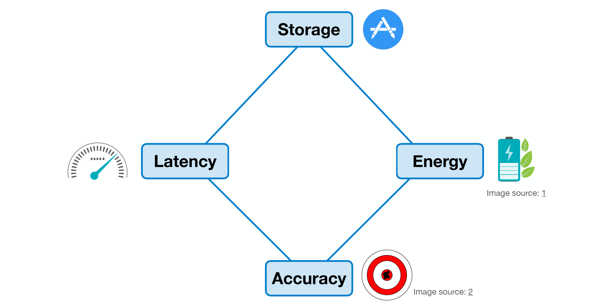
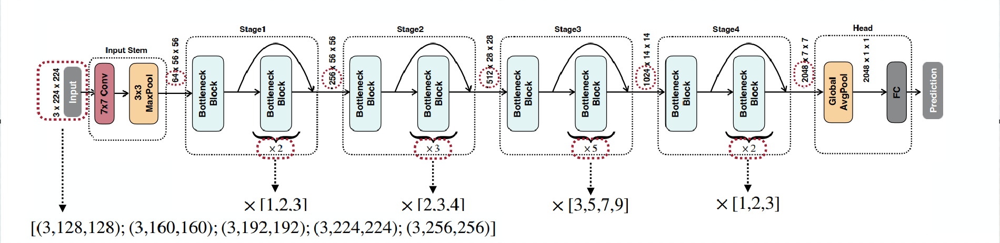
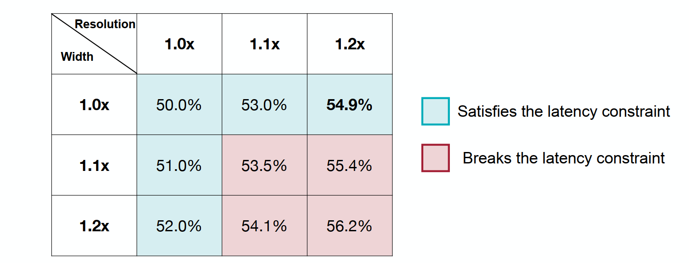
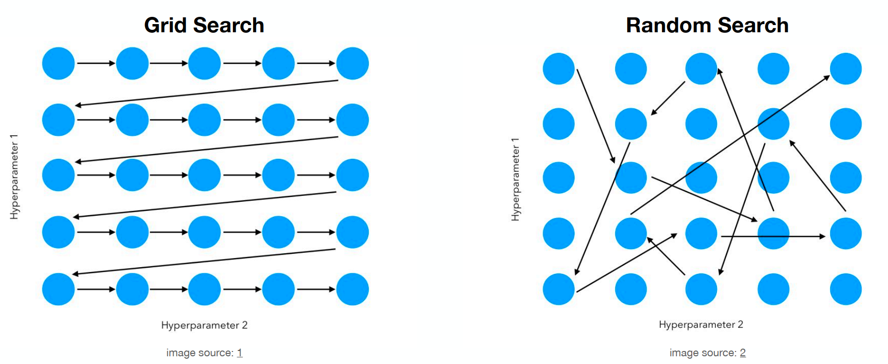
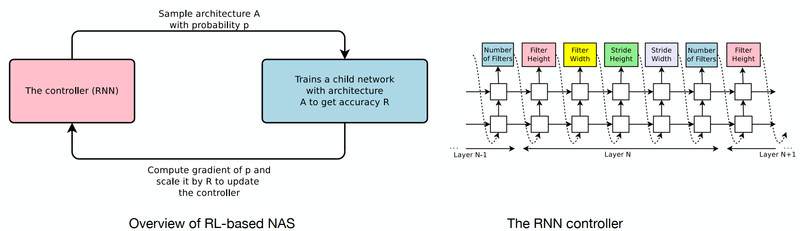
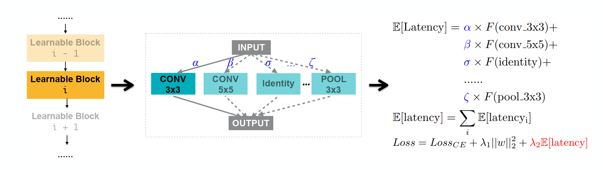
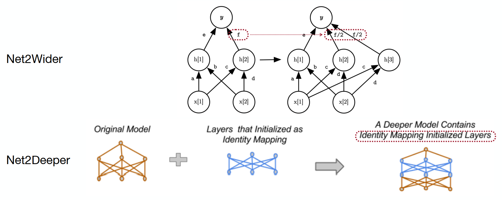
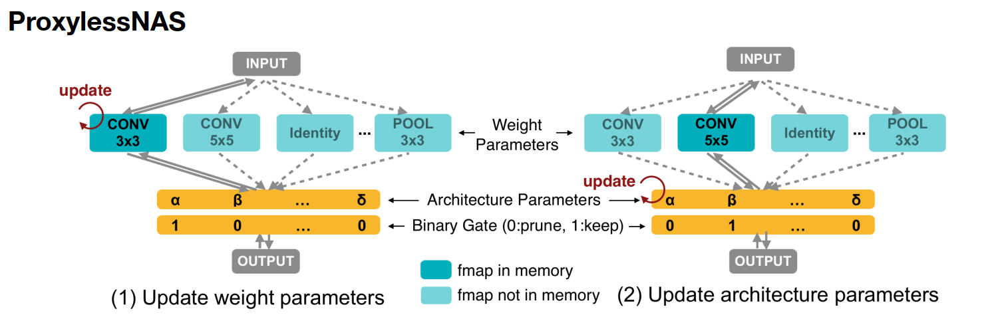

# datawhale 11 月组队学习 模型减肥秘籍——神经网络架构搜索

> datawhale课程链接：[https://www.datawhale.cn/learn/content/68/964]

[TOC]

## 神经网络架构搜索(Neural Architecture Search, NAS)

将神经网络的结构，参数量，组合方式当做搜索空间，利用相关的搜索算法配合对搜索过程的模型评估以此来快速搜索到合适的神经网络架构与参数。以满足**延时低**、**存储少**、**消耗少**，同时还要保持**模型精度**这四个目标的平衡。

## 搜索空间

传统人工设计的模型存在参数越来越大，性能越来越好的趋势，但也可以看到，能够在降低的模型参数的前提下与模型参数比较大的模型精度接近

1. **单元级搜索空间**：主要针对基础结构的组合，例如不同层的连接方式、激活函数的选择等，举例：假设我们有两个候选类型输入A和B(指不同的输入形状)，有$M$个不同的变换操作(比如线性层，卷积层等)以及$N$种组合隐藏层的操作(比如求和或平均)，如果整个网络有$L$层，那么该搜索空间有$\text{Search Space} = (2 \ast 2 \ast M \ast M \ast N)^{L} = 4^{L} M^{2L} N^{L}.  $

   假设$M=5, N=2,L=5$，也就是有5种基础模型，2种组合方式，以及5层网络层，结果为$3.2\times10^{11}$

   

   

2. **网络级搜索空间**：主要针对模块或网络的组合，例如ResNet的残差结构、Transformer中的多头注意力机制等。

   

   

如上图红圈所示可以针对残差结构中的深度进行搜索；可以对图像的解析度进行搜索；还可以对每一层的输入输出维度进行搜索

对硬件的考虑

针对硬件要考虑使用场景资源的有限性，考虑模型规模对应的的搜索空间

## 搜索策略的介绍

在确定神经网络架构的搜索空间后，为了找到符合目标的架构需要采用不同的搜索策略。介绍以下的五种搜索策略：

1. **网格搜索 (Grid Search)**：
   - 将所有可能的组合列出，形成一个“网格”，通过在网格上搜索来找到最佳结果。
   
   - 适用于小规模的搜索空间，但计算量较大。
   
     
   
     上述例子是对图片解析率和宽度做网格搜索，找到符合延迟情况下最好的参数。
   
2. **随机搜索 (Random Search)**：
   
   - 在网格搜索的基础上，随机打乱搜索顺序，以期更快找到合适的架构。

   - 这种方法有可能比网格搜索更有效。
   
     
   
3. **强化学习 (Reinforcement Learning)**：
   - 通过学习网络架构的设计，减少计算量。
   
   - 左图使用网络架构生成器生成架构，并通过训练评估准确率，反馈结果以优化生成策略
   
     右图规定了生成网络架构的顺序
   
     
   
4. **梯度下降 (Gradient Descent)**：
   - 将不同层的选择与目标函数关联，利用梯度下降优化网络架构。
   
   - 通过概率采样确定网络层，并在最后的目标函数中优化网络层的选择和概率。
   
     
   
5. **进化算法 (Evolutionary Search)**：
   
   - 在无法获得梯度信息的情况下，通过进化算法优化目标函数。
   
   - 通过对网络架构进行变异和交叉等操作，模拟自然选择过程，选择最优架构
   
     

## 模型性能评估

上面的方法通过在数据集上训练模型来评估其性能，这种方法成本高因为每次都需要重新训练模型，下面方法降低评估成本的情况下如何评估神经网络架构模型的性能

1. **权重继承 (Inherit Weight)**：
   
   - 新的神经网络架构可以从之前的架构中继承权重，从而减少训练成本。
   
   - 例如下图的Net2Wider和Net2Deeper模型，即拓宽或加深网络时，可以直接复制之前的权重，Net2Wider保持输入和输出的一致性
   
     
   
3. **超网络 (Hypernetwork)**：
   - 将神经网络架构和参数视为某个生成网络的结果，通过某一损失函数进行优化。
   
   - 下图过程：在每一个训练阶段，都从搜索空间随机采样一个神经网络架构。利用上述图中的图传播得到每一个节点的嵌入向量，再利用MLP生成网络参数，最后利用损失函数进行参数优化
   
     该网络并不需要额外对其得到的神经网络架构结果进行训练，因为其已经生成了对应的模型参数
   
     

## 以硬件为主的神经网络架构搜索

1. **硬件限制的挑战**：

   - 传统的NAS方法通常假设计算资源是无限的，但在实际应用中，不同设备的计算和存储能力各不相同。这导致在强大GPU上进行的搜索可能不适用于资源有限的设备。

2. **代理任务的使用**：

   - 例如，NASNet在CIFAR数据集上需要48,000GPU小时DARTS方法直接运行在ImageNet需要100GB的内存，为了降低计算成本，NAS通常使用代理任务（proxy tasks），但会得到次优的结果。

3. **ProxylessNAS方法**：

   

   - 该方法构建一个过量参数的模型，在单次训练过程中采样对应的NAS架构并对模型参数进行训练。通过剪枝去除多余路径，最终将架构参数二值化，内存就从O(N)下降到O(1)从而显著降低内存需求。

4. **MACs与硬件效率的关系**：

   

   - 传统NAS方法通常将MACs（乘加运算）作为目标，但在小型设备上，MACs并不总能反映真实的硬件效率。增加隐藏层可能在强大GPU上不增加延迟（增加模型层数才会增加gpu时延），但在小型设备上却会显著增加。

5. **多设备评估的效率问题**：

   - 在小型设备上评估模型的效率较低，增加设备数量虽然可以提高评估速度，但成本也会显著增加。为此：

     可以构建一个新的网络来预测当前模型参数在新设备上的性能，从而降低评估成本。

6. **跨设备的模型适应性**：

   

   - 传统NAS方法需要为每个设备单独搜索架构，成本高昂。通过在一个更大的模型中采样出某个模型，可以针对不同设备进行训练和评估，从而实现更高效的架构搜索。

## 神经网络架构搜索的应用介绍

Once-for-All([[1908.09791\] Once-for-All: Train One Network and Specialize it for Efficient Deployment](https://arxiv.org/abs/1908.09791))

在NLP、图像分类、目标检测、语音识别、图像生成、医学成像、边缘计算、自动化机器学习都有应用潜力，以熟悉的transformer为例：

通过对硬件时延的反馈对Transformer架构的搜索，得到适合在不同的设备上运行的模型(sub transformers(weight sharing))