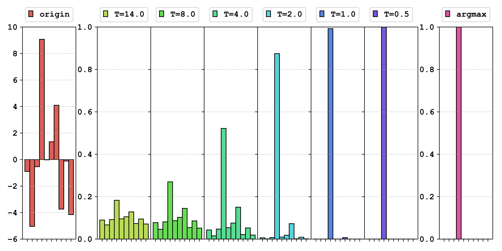
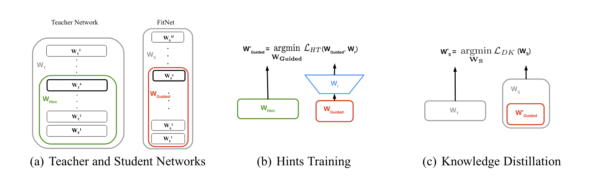

# datawhale 11 月组队学习 模型减肥秘籍——知识蒸馏

> datawhale课程链接：[https://www.datawhale.cn/learn/content/68/965]

[TOC]

知识蒸馏（Knowledge Distillation, KD）是一种模型压缩技术，旨在通过大模型（教师模型）指导小模型（学生模型）的训练，以提高小模型的性能，同时保持计算和内存的高效利用。以下是知识蒸馏的主要内容总结：

## 知识蒸馏的基本概念
- **教师模型**：一个预先训练好的复杂模型，通常性能优异但计算开销大，提供软标签或中间层的信息作为“知识”。
- **学生模型**：一个较小、较简单的模型，旨在模仿教师模型的行为接近教师模型的性能，学生模型一般使用交叉熵计算硬标签的损失
- **硬标签与软标签**：
  - **硬标签**：每个样本或模型输出的的真实类别标签。
  - **软标签**：教师模型输出的概率分布，包含更多信息，可以通过温度调节将输出的概率分布软化，使学生模型更好的学习概率间的相关关系。

## 知识蒸馏的过程

步骤：

1. **输入数据**：将训练图片 $ \mathbf{x} $ 输入到教师模型（Teacher Model）。

2. **生成软目标**：

   - 教师模型通过 Softmax 函数处理输出，生成软目标（soft target） $ \mathbf{s} = [p_1, p_2, \ldots, p_K] $，其中 $ K $ 是类别总数。
   - 输出经过温度系数 $ T $ 调整，以平滑标签概率分布，提供更丰富的信息给学生模型。

3. **学生模型输出**：

   - 学生模型同样输入相同的图片 $ \mathbf{x} $，并生成自己的输出概率分布。
   - 学生模型也使用相同的温度 $ T $ 进行概率分布的平滑处理。

4. **计算损失**：

   - **软损失（Soft loss）**：通过 KL 散度（Kullback-Leibler Divergence）计算学生模型输出与教师模型输出之间的损失，帮助学生模型学习教师模型的预测分布。
   - **硬损失（Hard loss）**：学生模型的输出与真实标签（hard target）进行比较，计算交叉熵损失（cross-entropy loss），确保学生模型在标准分类任务上一定的性能。

5. **总损失**：软损失和硬损失的加权和形成总损失，使用权重参数 $ \lambda $ 控制两者的平衡：
   $$
   \text{Total loss} = \lambda \times \text{Soft loss} + (1 - \lambda) \times \text{Hard loss}
   $$

## 温度的作用
温度在知识蒸馏中用于调整教师模型输出的概率分布，以便更好地指导学生模型的学习。温度的计算过程如下：

1. **Softmax 函数**：

   - 对于某个模型的输出 $ \mathbf{z} = [z_1, z_2, \ldots, z_K] $，传统的 Softmax 计算为：
     $$
     softmax_i(1) = \frac{e^{z_i}}{\sum_{j=1}^K e^{z_j}}
     $$

   - 带温度的 Softmax 计算为：
     $$
     softmax_i(\tau) = \frac{e^{z_i/\tau}}{\sum_{j=1}^K e^{z_j/\tau}}
     $$
     其中 $ \tau $ 表示温度。

     

2. **温度的影响**：

   - 当温度 $ \tau = 1 $ 时，输出与传统 Softmax 相同。

   - 较小的温度会导致输出概率分布更加尖锐，较大的温度则使输出概率分布更加平滑

     

     > 最左侧Origin表示的是某个分类网络对任意一张图片的输出Logits的分布。其中横坐标表示的是具体的类别号，而纵轴表示的是网络对于具体某个类型的预测值。而最右侧的是对 Logits 进行 Argmax() 后的结果

   - 当需要考虑负标签之间的关系时，可以采用较大的温度，需要消除负标签中噪声的影响的时候，需要较小的温度

     比如NLP任务中可能要学习猫/狗标签之间的关联性，需要大温度

3. **训练一致性**：

   - 学生模型的输出也需要使用相同的温度进行 Softmax 计算，以便在相似的概率分布上进行比较和学习

## 损失函数
- 知识蒸馏的损失函数由软损失（通常使用KL散度）和硬损失（交叉熵损失）线性结合而成。

- 通过调节权重参数，控制学生模型对教师模型指导和真实标签的依赖程度

  知识蒸馏的损失函数由软损失和硬损失线性结合而成，具体定义如下：

  1. **软损失（Soft Loss）**：
     - 通过计算教师模型的软标签 $$ p(\tau) $$ 和学生模型的软标签 $$ q(\tau) $$ 之间的 Kullback-Leibler 散度来定义：
     $$
     \mathcal{L}_{\text{KL}} = \text{KL}(q(\tau), p(\tau)) = \sum_{j} p_j(\tau) \log \frac{p_j(\tau)}{q_j(\tau)}
     $$
     - 

  2. **硬损失（Hard Loss）**：
     
     - 通过计算学生模型输出 $$ q(\tau=1) $$ 与真实标签 $$ y $$ 之间的交叉熵损失来定义：
       $$
       \mathcal{L}_{\text{CE}} = \text{CE}(q(\tau=1), y) = \sum_{j} -y_j \log q_j(1)
       $$
       
     
  3. **总损失函数**：
     - 最终的损失函数结合了软损失和硬损失，形式为：
       $$
       \text{Loss} = \alpha \cdot \mathcal{L}_{\text{CE}} + \beta \cdot \tau^2 \cdot \mathcal{L}_{\text{KL}} 
       = \alpha \cdot \text{CE}(q(\tau = 1), y) + \beta \cdot \tau^2 \cdot \text{KL}(q(\tau), p(\tau))
       $$
     - 其中 $$ \alpha $$ 和 $$ \beta $$ 是权重参数，通常满足 $$ \alpha + \beta = 1 $$。在实践中，常取 $$ \alpha = 0.1 $$ 和 $$ \beta = 0.9 $$。
     - 乘以 $$ \tau^2 $$ 的原因是为了保持软损失和硬损失在梯度上的平衡

## 知识蒸馏匹配

蒸馏方法不仅限于输出 logits 的匹配，还包括中间层特征、权重、注意力图、稀疏模式及层间相关信息、样本间相关信息的匹配：

#### 匹配中间层权重
- 通过匹配教师网络和学生网络在中间层的权重进行训练，类似向学生模型输入教师模型的思考过程。

- 需要加入线性转换层以对齐教师网络和学生网络的维度

  

  

#### 匹配中间层特征
- Neuron Selectivity Transfer方法：教师模型和学生模型在每个对应的中间层之间进行特征图（FeatureMap）匹配，使用KDLoss最小化特征图的差异，使用最大平均差异（Maximum Mean Discrepancy,MMD）作为损失函数来衡量模型特征之间的差异。

  

  

#### 匹配中间层注意力图
- 使用特征图的梯度来表示DNN的注意力机制，注意力图显示了网络对输入图像中哪些部分的关注程度。通过匹配注意力图，学生模型可以更好地理解输入的重要特征。

- CNN为例特征图的注意力用$ \frac{\partial L}{\partial x}$表示，$L$为损失函数，$x$特征图；若$\frac{\partial L}{\partial x_{i,j}}$越大，证明$(i,j)$的注意力越重。

  

  

#### 匹配中间层稀疏模式
- 通过教师模型和学生模型在 ReLU 激活后的稀疏性模式匹配进行知识蒸馏。

- 教师和学生网络在激活后应具有相似的稀疏性模式，以确保学生模型能够学习到教师模型的特征

  

#### 匹配相关信息
- 匹配教师模型和学生模型不同层之间的关系信息。
- 通过内积操作生成关系矩阵，使用 L2 损失比较教师和学生网络之间的关系，确保学生网络学习到与教师网络相似的表示

#### 匹配样本关系

- 比较了不同样本之间的关系结构，超越了传统每个输入样本的特征或输出的对齐的方法。它通过观察多个输入样本之间的关系，从而进行结构到结构的匹配，使学生网络能够更全面地捕捉教师网络的特征映射

  

## 自蒸馏和在线蒸馏

#### 自蒸馏

- 模型自身既充当教师模型，又充当学生模型。学生模型不依赖于外部的教师模型，而是从模型的某个阶段之输出作为指导信号/监督信号，并从多次训练步骤中学习每个前阶段的知识提高模型性能。

- **过程**：
  1. **初始训练**：首先训练一个教师网络 $ T $，输入数据 $ X $ 后得到输出 $ f(X) $，并与真实标签 $ y $ 进行对比，训练教师网络。
  
  2. **逐步蒸馏**：
     - 在第一步中，使用教师网络的输出作为学生网络 $ S_1 $ 的监督信号，同时保留真实标签 $ y $。
     - 学生网络基于教师网络的输出继续进行训练。

  3. **迭代训练**：经过多次迭代训练，每个新的学生网络 $ S_k $ 都使用前一阶段学生网络的输出 $ f_{k-1}(X) $ 进行训练。
  
     Born-Again：
  
     
  
- 自蒸馏不需要额外的教师模型，模型通过自我监督不断提升性能

#### 在线蒸馏

- 在线蒸馏的主要思想是在教师网络和学生网络之间添加一个蒸馏目标，以最小化对方的输出分布。教师模型和学生模型可以是相同或不同的网络。

- **过程**：
  
  1. **同步训练**：两个神经网络（教师网络 $ T $ 和学生网络 $ S $）从头开始训练，接收相同的输入图像。
  2. **输出对比**：每个网络生成预测结果（logits），然后通过对比两个网络输出的概率分布，计算 KL 散度来约束网络之间的相互学习。
  3. **损失函数**：
     
     - 网络1的损失函数： 
       $$
       L(S) = {CrossEntropy}(S(I), y) + KL(S(I), T(I))
       $$
     - 网络2的损失函数：
       $$
       L(T) = {CrossEntropy}(T(I), y) + KL(T(I),S(I))
       $$
  
  
  
- 在线蒸馏允许教师模型和学生模型同时学习并相互传递知识，避免了传统蒸馏方法中需要预先训练教师模型的步骤。

### 结合在线蒸馏和自蒸馏

通过深度监督 + 蒸馏来优化模型：使用深层网络的输出去蒸馏较浅层的预测，提升浅层的学习能力。模型不仅可以从自身的不同层次中学习，还可以通过在线的方式与其他模型进行相互学习

- **流程**：输入图像经过多个残差块和瓶颈层后输出分类结果，瓶颈层的输出用于监督较浅层的输出，包括利用标签的交叉熵损失、深层的蒸馏KL散度损失以及特征的L2损失提供来自深层网络的监督

## 知识蒸馏的应用

知识蒸馏作为一种有效的模型压缩和知识转移技术，广泛应用于多个领域。以下是知识蒸馏的一些主要应用场景：

#### 图像分类
- 使用复杂的教师网络，如 ResNet、DenseNet，来训练较小的学生网络。这种方式能够提高小型模型在图像分类任务中的表现，使其接近大型模型的性能。

#### 目标检测
- **应用**：在计算机视觉中的目标检测任务，知识蒸馏可以用于优化检测器。
- 教师模型执行对象检测，然后将检测的知识传递给较小的学生模型，以提高其检测准确性和速度。例如，基于 Faster R-CNN 的教师模型可以传授知识给轻量级的 SSD 学生模型。

#### 自然语言处理

AttentionKD：

左为T，右为S，如图：转移了特征图和注意力，右图表明转移T的注意力分布很清晰而且S加不加注意力效果差别很大

以bert为例：通常会使用两种蒸馏压缩后的变体作为S，以bert-base、large等作为T

- **DistilBERT**：

  DistilBERT通常为6层的Transformer编码器，与原始BERT的12层相比，参数量减少约40%。

  采用简单的知识蒸馏，主要关注于教师输出的软标签，用作学生模型的训练目标。

- **TinyBERT**：

  提供4层或6层Transformer编码器，甚至更小；使用双阶段蒸馏，即首先进行答案蒸馏，其次进行特征蒸馏。这允许学生模型在多个层次上模仿教师模型的中间表示。

  TinyBERT的压缩比率更高，参数量量级可低于14M。

#### 生成模型
- 通过蒸馏、重构和对抗性损失来实现S蒸馏
- 蒸馏损失：确保学生生成器学到教师生成器的特征和知识，有助于在压缩时保留性能。
- 重构损失：通过强制学生生成器的输出与真实数据或教师输出匹配，确保模型在生成任务中具有高质量的表现。
- 对抗损失：传统的GAN训练目标，保证学生生成器的输出在视觉上尽可能接近真实图像。

## 网络增强

一般的模型会通过数据增强和dropout等环节过拟合，KD训练微型学生模型实际效果往往会欠拟合，[NetAug](https://arxiv.org/abs/2110.08890)增加了网络（反向dropout），将微小模型嵌入到更大的模型中，不仅促使微小模型独立发挥作用，同时也作为大模型的子模型接受额外的监督

小型网络与大网络共享权重，并接受监督以生成对大网络有用的表示。在训练过程中，通过增强网络提供辅助监督，而在测试时仅使用小型网络进行推理，无需额外开销。此外，右图解释了通过宽度乘数和扩展比率来实际实施NetAug的结构调整方法，以增强小型神经网络的能力。