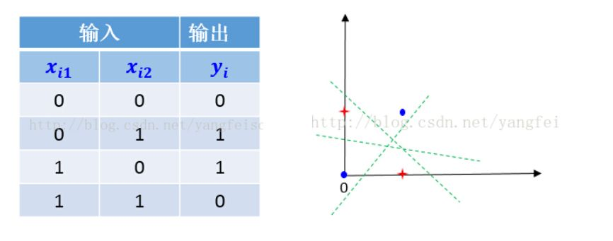
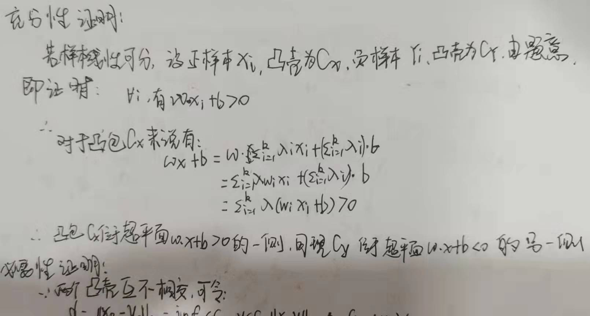
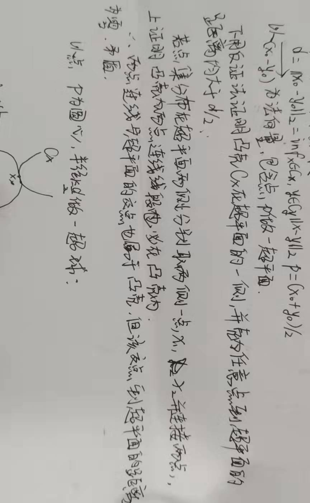
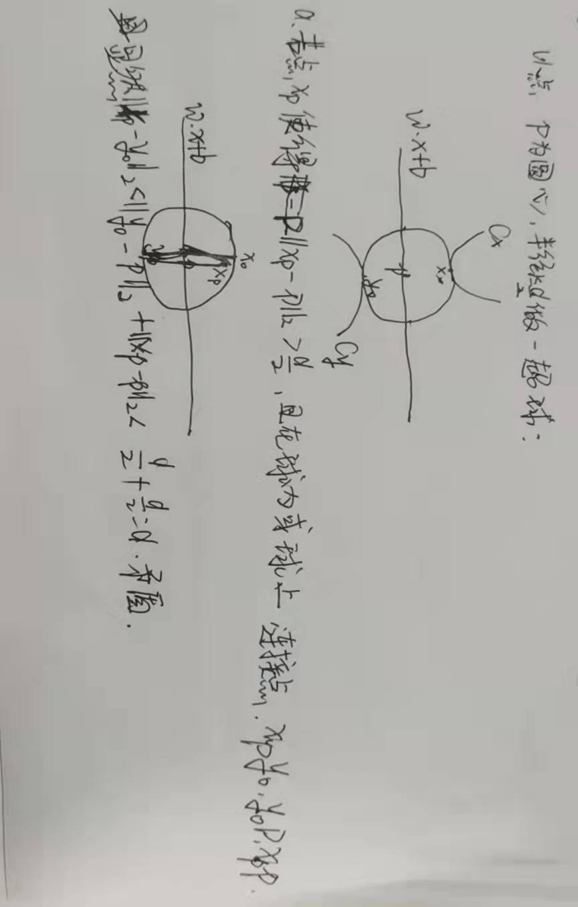
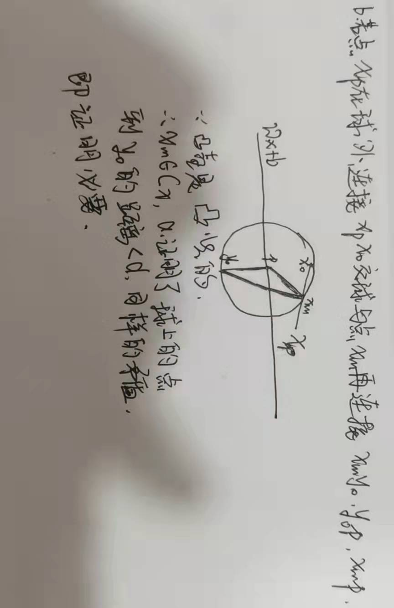

# 感知机

## 习题 [答案](https://datawhalechina.github.io/statistical-learning-method-solutions-manual/#/chapter02/chapter02?id=%e4%b9%a0%e9%a2%9821)

### 2.1 Minsky和Papert指出：感知机因为是线性模型，所以不能表示复杂的函数，如异或。验证感知机为什么不能表示异或?

异或的图像由上图所示，由数据集线性可分的定义可知，感知机等线性模型并不能做到线性分割。

答案还提供了反证法。

### 2.2 模仿例题 2.1，构建从训练数据求解感知机模型的例子。

### 2.3 样本集线性可分的充要条件是正实例点集所构成的凸壳和负实例点集构成的凸壳不相交

