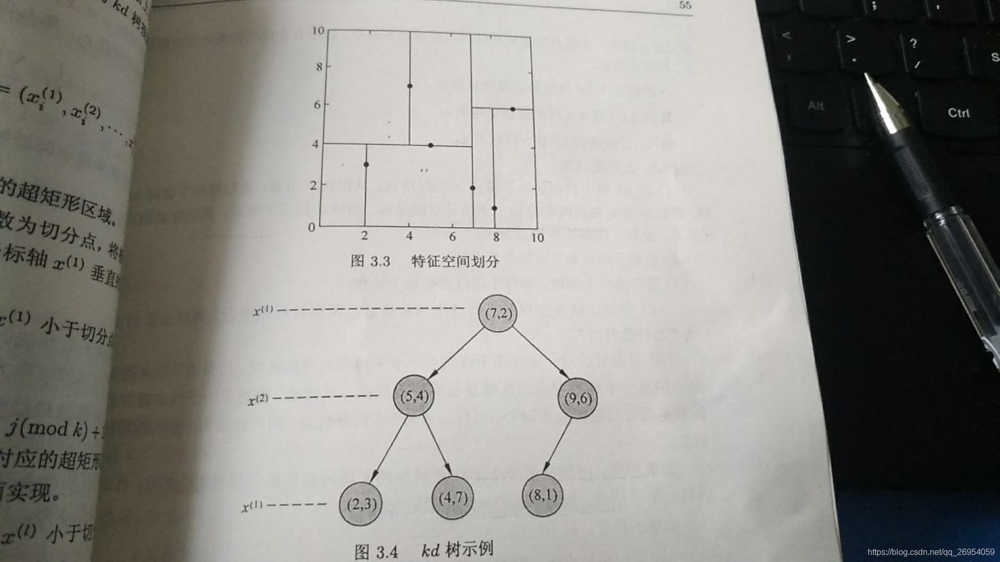

### 3.1 参照图3.1，在二维空间中给出实例点，画出k为1和2时的k近邻法构成的空间划分，并对其进行比较，体会k值选择与模型复杂度及预测准确率的关系。

**k=1比较好理解，就是各自为政**，自己有自己的一块区域，书上的图3.1即为k=1时，两个或多个点互相连接找连接线中垂线，以中垂线划分区域。**而k=2也是找垂线但是垂线互相交叉**，划分多个区域找区域相近的两个点一个单元，如下图中的区域AB为AB近邻但与A更近，这样可以推广为多个点。**k=3可能在二维点上无法划分**，可能需要在三维上去画图。


### 3.2 利用例题3.2构造的kd树求点$x=(3,4.5)^T$的最近邻点。



$x = (x^{(0)},x^{(1)})= (3,4.5)$依照算法3.3步骤：

1. 从根节点（7，2）比较x0值，将输入分在左边节点（5，4），即左边的矩形区域。

2. 在节点（5，4）比较x1的值，输入走右边，到叶节点（4，7）通过欧氏距离算距离2.69，记录“当前最近节点”（4，7），然后检查是否父节点的另外一个节点是否与目标点和“最近节点“距离的超球体相交。


3. 如果相交，进行最近邻搜索，计算（2，3）与目标点的距离1.802，距离更新记录，然后回退；如果不想交则直接回退父节点。

同样的步骤，最后回退到根节点结束。

**最后答案为（2，3）为最近邻节点。**

### 3.3 参照算法3.3，写出输出为x的k近邻的算法

```python3
import numpy as np
import pandas as pd
import matplotlib.pyplot as plt
from sklearn.datasets import load_iris
from sklearn.model_selection import train_test_split
from collections import Counter

# data
iris = load_iris()
df = pd.DataFrame(iris.data, columns=iris.feature_names)
df['label'] = iris.target
df.columns = ['sepal length', 'sepal width', 'petal length', 'petal width', 'label']
# data = np.array(df.iloc[:100, [0, 1, -1]])

plt.figure(figsize=(15, 8))
plt.subplot(121)
plt.scatter(df[:50]['sepal length'], df[:50]['sepal width'], label='0')
plt.scatter(df[50:100]['sepal length'], df[50:100]['sepal width'], label='1')
plt.xlabel('sepal length')
plt.ylabel('sepal width')
plt.legend()
plt.title('original data')

data = np.array(df.iloc[:100, [0, 1, -1]])
X, y = data[:,:-1], data[:,-1]
X_train, X_test, y_train, y_test = train_test_split(X, y, test_size=0.2)


class KNN:
    def __init__(self, X_train, y_train, n_neighbors=3, p=2):
        """
        parameter: n_neighbors 临近点个数
        parameter: p 距离度量
        """
        self.n = n_neighbors
        self.p = p
        self.X_train = X_train
        self.y_train = y_train

    def predict(self, X):
        # 取出n个点
        knn_list = []
        for i in range(self.n):
            dist = np.linalg.norm(X - self.X_train[i], ord=self.p)
            knn_list.append((dist, self.y_train[i]))

        for i in range(self.n, len(self.X_train)):
            max_index = knn_list.index(max(knn_list, key=lambda x: x[0])) #这里的knn_list相当于是一个二维数组，所以lambda中取x[0]
            dist = np.linalg.norm(X - self.X_train[i], ord=self.p)
            if knn_list[max_index][0] > dist:
                knn_list[max_index] = (dist, self.y_train[i]) #注意这里的括号


        # 统计
        knn = [k[-1] for k in knn_list]
        count_pairs = Counter(knn) #count_pairs为键值对的形式
        max_count = sorted(count_pairs.items(), key=lambda x: x[1])[-1][0] #这里的lambda变量取得是x[1]
        return max_count


    def score(self, X_test, y_test):
        right_count = 0
        n = 10
        for X, y in zip(X_test, y_test):
            label = self.predict(X)
            if label == y:
                right_count += 1
        return right_count / len(X_test)


clf = KNN(X_train, y_train)
print('Test_score: {}'.format(clf.score(X_test, y_test)))
test_point = [6.0, 3.0]
print('Test Point: {}'.format(clf.predict(test_point)))

plt.subplot(122)
plt.scatter(df[:50]['sepal length'], df[:50]['sepal width'], label='0')
plt.scatter(df[50:100]['sepal length'], df[50:100]['sepal width'], label='1')
plt.plot(test_point[0], test_point[1], 'bo', label='test_point')
plt.xlabel('sepal length')
plt.ylabel('sepal width')
plt.legend()
plt.title('classification by KNN(n=3, p=2)')
plt.subplots_adjust(top=0.92, bottom=0.08, left=0.10, right=0.95, hspace=0.25,
                        wspace=0.35) #调整子图间距
plt.savefig("demo.jpg")
plt.show()
```


output:

```python3
Test_score: 1.0
Test Point: 1.0
```

