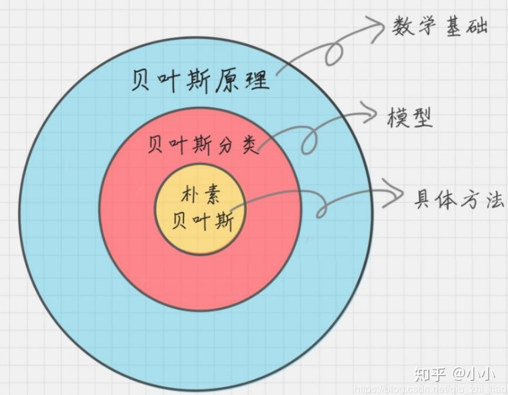
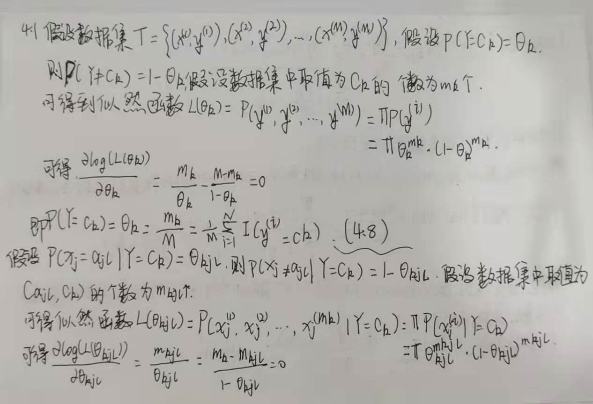
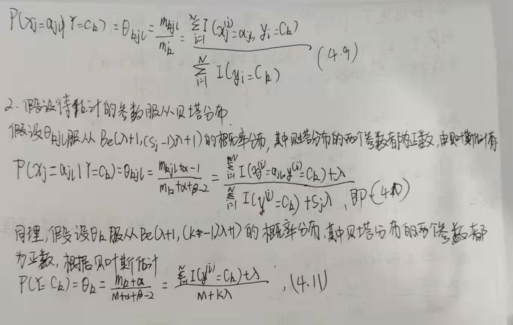

# 朴素贝叶斯！

> 我的入门模型

nb是一种生成模型。之所以称为朴素，是因为它有有个重要的前提假设：**每个输入变量是独立的。**

> 首先介绍朴素贝叶斯，在此之前可能听到过贝叶斯原理、贝叶斯分类、朴素贝叶斯，其实这三者之间是有区别的，看下面这张图，就一目了然。

[极大似然估计和贝叶斯定理](https://www.matongxue.com/madocs/447/)

## 习题

### 1. 用极大似然估计法推出朴素贝叶斯法中的概率估计公式(4.8)及公式 (4.9)。

### 2. 用贝叶斯估计法推出朴素贝叶斯法中的慨率估计公式(4.10)及公式(4.11)

