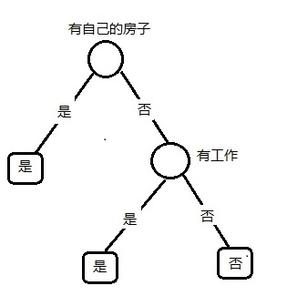

# 习题

## 1.根据表5.1所给的训练数据集，利用信息增益比（C4.5算法）生成决策树。

**解答：**

表5.1 贷款申请样本数据表

| ID   | 年龄 | 有工作 | 有自己的房子 | 信贷情况 | 类别 |
| ---- | ---- | ------ | ------------ | -------- | ---- |
| 1    | 青年 | 否     | 否           | 一般     | 否   |
| 2    | 青年 | 否     | 否           | 好       | 否   |
| 3    | 青年 | 是     | 否           | 好       | 是   |
| 4    | 青年 | 是     | 是           | 一般     | 是   |
| 5    | 青年 | 否     | 否           | 一般     | 否   |
| 6    | 中年 | 否     | 否           | 一般     | 否   |
| 7    | 中年 | 否     | 否           | 好       | 否   |
| 8    | 中年 | 是     | 是           | 好       | 是   |
| 9    | 中年 | 否     | 是           | 非常好   | 是   |
| 10   | 中年 | 否     | 是           | 非常好   | 是   |
| 11   | 老年 | 否     | 是           | 非常好   | 是   |
| 12   | 老年 | 否     | 是           | 好       | 是   |
| 13   | 老年 | 是     | 否           | 好       | 是   |
| 14   | 老年 | 是     | 否           | 非常好   | 是   |
| 15   | 老年 | 否     | 否           | 一般     | 否   |

根据书上已经计算提供的数据, 我们有:

![[公式]](https://www.zhihu.com/equation?tex=H%28D%29%3D0.971)

![[公式]](https://www.zhihu.com/equation?tex=g%28D%2CA_1%29%3D0.083) , ![[公式]](https://www.zhihu.com/equation?tex=H_%7BA_1%7D%28D%29%3D1.585) , ![[公式]](https://www.zhihu.com/equation?tex=g_R%28D%2CA_1%29+%3D+0.052)

![[公式]](https://www.zhihu.com/equation?tex=g%28D%2CA_2%29%3D0.324) , ![[公式]](https://www.zhihu.com/equation?tex=H_%7BA_2%7D%28D%29%3D0.918) , ![[公式]](https://www.zhihu.com/equation?tex=g_R%28D%2CA_2%29+%3D+0.353)

![[公式]](https://www.zhihu.com/equation?tex=g%28D%2CA_3%29%3D0.420) , ![[公式]](https://www.zhihu.com/equation?tex=H_%7BA_3%7D%28D%29%3D0.420) , ![[公式]](https://www.zhihu.com/equation?tex=g_R%28D%2CA_3%29+%3D+0.433)

![[公式]](https://www.zhihu.com/equation?tex=g%28D%2CA_4%29%3D0.363) , ![[公式]](https://www.zhihu.com/equation?tex=H_%7BA_4%7D%28D%29%3D0.363) , ![[公式]](https://www.zhihu.com/equation?tex=g_R%28D%2CA_4%29+%3D+0.232)

所以根据**信息增益比**的原则, 我们选择特征"**有自己的房子**"为切分点.

在左结点里, 所有"**有自己的房子==是**"的实例数据的类别均为"是", 所以左结点为叶结点, 结点类别为"是".

在右结点里, 我们首先整理出子数据集 ![[公式]](https://www.zhihu.com/equation?tex=D%27) :

| 年龄 | 有工作 | 信贷情况 | 类别 |
| ---- | ------ | -------- | ---- |
| 青年 | 否     | 一般     | 否   |
| 青年 | 否     | 好       | 否   |
| 青年 | 是     | 好       | 是   |
| 青年 | 否     | 一般     | 否   |
| 中年 | 否     | 一般     | 否   |
| 中年 | 否     | 好       | 否   |
| 老年 | 是     | 好       | 是   |
| 老年 | 是     | 非常好   | 是   |
| 老年 | 否     | 一般     | 否   |

![[公式]](https://www.zhihu.com/equation?tex=H%28D%27%29%3D0.918)

![[公式]](https://www.zhihu.com/equation?tex=g%28D%27%2CA_%7B%5Ctext%7B%E5%B9%B4%7D%7D%29%3D0.252%2C+H_%7BA_%7B%5Ctext%7B%E5%B9%B4%7D%7D%7D%28D%27%29%3D1.530%2C+g_R%28D%27%2C+A_%7B%5Ctext%7B%E5%B9%B4%7D%7D%29%3D0.165)

![[公式]](https://www.zhihu.com/equation?tex=g%28D%27%2CA_%7B%5Ctext%7B%E5%B7%A5%7D%7D%29%3D0.918%2C+H_%7BA_%7B%5Ctext%7B%E5%B7%A5%7D%7D%7D%28D%27%29%3D0.918%2C+g_R%28D%27%2C+A_%7B%5Ctext%7B%E5%B7%A5%7D%7D%29%3D1)

![[公式]](https://www.zhihu.com/equation?tex=g%28D%27%2CA_%7B%5Ctext%7B%E4%BF%A1%7D%7D%29%3D0.474%2C+H_%7BA_%7B%5Ctext%7B%E4%BF%A1%7D%7D%7D%28D%27%29%3D1.392%2C+g_R%28D%27%2C+A_%7B%5Ctext%7B%E4%BF%A1%7D%7D%29%3D0.341)

所以在右结点选择特征"有工作", 以此切分后, 左右结点的实例数据子集都是单一类别的.

由此, 我们完成了根据**信息增益比**的**C4.5决策树**构造, 见下图.



## 2. 已知如表5.2所示的训练数据，试用平方误差损失准则生成一个二叉回归树。

表5.2 训练数据表

| $x_i$ | 1    | 2    | 3    | 4    | 5    | 6    | 7    | 8    | 9    |   10 |
| ----- | ---- | ---- | ---- | ---- | ---- | ---- | ---- | ---- | ---- | ---: |
| $y_i$ | 4.50 | 4.75 | 4.91 | 5.34 | 5.80 | 7.05 | 7.90 | 8.23 | 8.70 | 9.00 |

此题并未验证，答案来自datawhale：

> **解答思路：**

1. 根据书中第81页平方误差损失准则，列出最小二乘回归树生成算法（算法5.5）；
2. 编写代码，实现算法，并用表5.2训练数据进行验证。

> ```python
> import json
> 
> import numpy as np
> 
> 
> # 节点类
> class Node:
>     def __init__(self, value, feature, left=None, right=None):
>         self.value = value.tolist()
>         self.feature = feature.tolist()
>         self.left = left
>         self.right = right
> 
>     def __repr__(self):
>         return json.dumps(self, indent=3, default=lambda obj: obj.__dict__, ensure_ascii=False)
> ```
>
> ```python
> class MyLeastSquareRegTree:
>     def __init__(self, train_X, y, epsilon):
>         # 训练集特征值
>         self.x = train_X
>         # 类别
>         self.y = y
>         # 特征总数
>         self.feature_count = train_X.shape[1]
>         # 损失阈值
>         self.epsilon = epsilon
>         # 回归树
>         self.tree = None
> 
>     def _fit(self, x, y, feature_count):
>         # （1）选择最优切分点变量j与切分点s，得到选定的对(j,s)，并解得c1，c2
>         (j, s, minval, c1, c2) = self._divide(x, y, feature_count)
>         # 初始化树
>         tree = Node(feature=j, value=x[s, j], left=None, right=None)
>         # 用选定的对(j,s)划分区域，并确定响应的输出值
>         if minval < self.epsilon or len(y[np.where(x[:, j] <= x[s, j])]) <= 1:
>             tree.left = c1
>         else:
>             # 对左子区域调用步骤（1）、（2）
>             tree.left = self._fit(x[np.where(x[:, j] <= x[s, j])],
>                                   y[np.where(x[:, j] <= x[s, j])],
>                                   self.feature_count)
>         if minval < self.epsilon or len(y[np.where(x[:, j] > s)]) <= 1:
>             tree.right = c2
>         else:
>             # 对右子区域调用步骤（1）、（2）
>             tree.right = self._fit(x[np.where(x[:, j] > x[s, j])],
>                                    y[np.where(x[:, j] > x[s, j])],
>                                    self.feature_count)
>         return tree
> 
>     def fit(self):
>         self.tree = self._fit(self.x, self.y, self.feature_count)
>         return self
> 
>     @staticmethod
>     def _divide(x, y, feature_count):
>         # 初始化损失误差
>         cost = np.zeros((feature_count, len(x)))
>         # 公式5.21
>         for i in range(feature_count):
>             for k in range(len(x)):
>                 # k行i列的特征值
>                 value = x[k, i]
>                 y1 = y[np.where(x[:, i] <= value)]
>                 c1 = np.mean(y1)
>                 y2 = y[np.where(x[:, i] > value)]
>                 if len(y2) == 0:
>                     c2 = 0
>                 else:
>                     c2 = np.mean(y2)
>                 y1[:] = y1[:] - c1
>                 y2[:] = y2[:] - c2
>                 cost[i, k] = np.sum(y1 * y1) + np.sum(y2 * y2)
>         # 选取最优损失误差点
>         cost_index = np.where(cost == np.min(cost))
>         # 所选取的特征
>         j = cost_index[0][0]
>         # 选取特征的切分点
>         s = cost_index[1][0]
>         # 求两个区域的均值c1,c2
>         c1 = np.mean(y[np.where(x[:, j] <= x[s, j])])
>         c2 = np.mean(y[np.where(x[:, j] > x[s, j])])
>         return j, s, cost[cost_index], c1, c2
> 
>     def __repr__(self):
>         return str(self.tree)
>     
>     train_X = np.array([[1, 2, 3, 4, 5, 6, 7, 8, 9, 10]]).T
>     y = np.array([4.50, 4.75, 4.91, 5.34, 5.80, 7.05, 7.90, 8.23, 8.70, 9.00])
> 
>     model_tree = MyLeastSquareRegTree(train_X, y, epsilon=0.2)
>     model_tree.fit()
>     model_tree
> 
> ```
>
> ```markup
> {
>    "value": 5,
>    "feature": 0,
>    "left": {
>       "value": 3,
>       "feature": 0,
>       "left": 4.72,
>       "right": 5.57
>    },
>    "right": {
>       "value": 7,
>       "feature": 0,
>       "left": {
>          "value": 6,
>          "feature": 0,
>          "left": 7.05,
>          "right": 7.9
>       },
>       "right": {
>          "value": 8,
>          "feature": 0,
>          "left": 8.23,
>          "right": 8.85
>       }
>    }
> }
> ```

## 3.证明 CART 剪枝算法中，当$\alpha$确定时，存在唯一的最小子树$T_{\alpha}$使损失函数$C_{\alpha}(T)$最小。

对于决策树生成算法生成原始数 ![[公式]](https://www.zhihu.com/equation?tex=T) ，假设存在2棵不同的最小子树 ![[公式]](https://www.zhihu.com/equation?tex=T_%7B%5Calpha_1%7D) 和 ![[公式]](https://www.zhihu.com/equation?tex=T_%7B%5Calpha_2%7D) 使得损失函数 ![[公式]](https://www.zhihu.com/equation?tex=C_%5Calpha%28T%29) 最小化.

由于两棵子树不相同, 所以它们的剪枝方法 ![[公式]](https://www.zhihu.com/equation?tex=s_1+%5Cne+s_2) , 由于根据CART剪枝算法, 其中剪枝的每一步都使得损失函数 ![[公式]](https://www.zhihu.com/equation?tex=C_%5Calpha%28T%29) 变低. 所以令 ![[公式]](https://www.zhihu.com/equation?tex=s_%2A+%3D+s_1+%5Ccup+s_2) , 由 ![[公式]](https://www.zhihu.com/equation?tex=s_%2A) 剪枝法生成的决策树为 ![[公式]](https://www.zhihu.com/equation?tex=T_%2A) . 那么就会有 ![[公式]](https://www.zhihu.com/equation?tex=C_%5Calpha%28T_%2A%29+%3C+C_%5Calpha%28T_%7B%5Calpha_1%7D%29) 以及 ![[公式]](https://www.zhihu.com/equation?tex=C_%5Calpha%28T_%2A%29+%3C+C_%5Calpha%28T_%7B%5Calpha_2%7D%29) . 所以与假设 ![[公式]](https://www.zhihu.com/equation?tex=T_%7B%5Calpha_1%7D) 和 ![[公式]](https://www.zhihu.com/equation?tex=T_%7B%5Calpha_2%7D) 是使损失函数最小化的最小字数矛盾.

## 4.证明 CART 剪枝算法中求出的子树序列$\{T_0,T_1,\cdots,T_n\}$分别是区间$\alpha \in [\alpha_i,\alpha_{i+1})$的最优子树$T_{\alpha}$**，这里$i=0,1,\cdots,n,0=\alpha_0 < \alpha_1 < \cdots, \alpha_n < +\infty$。

首先我们需要回顾一下CART剪枝算法中, 我们对 ![[公式]](https://www.zhihu.com/equation?tex=T_0) 中每一内部结点 ![[公式]](https://www.zhihu.com/equation?tex=t) 都计算了:

![[公式]](https://www.zhihu.com/equation?tex=%5Calpha_t+%3D+g%28t%29+%3D+%5Cfrac%7BC%28t%29-C%28T_t%29%7D%7B%7CT_t%7C+-+1%7D). 剪枝的过程即是在 ![[公式]](https://www.zhihu.com/equation?tex=T_i) 中减去 ![[公式]](https://www.zhihu.com/equation?tex=g%28t%29) 第 ![[公式]](https://www.zhihu.com/equation?tex=i%2B1) 小的 ![[公式]](https://www.zhihu.com/equation?tex=T_%7Bt_%7Bi%2B1%7D%7D)作为 ![[公式]](https://www.zhihu.com/equation?tex=T_%7Bi%2B1%7D) , 同时将 ![[公式]](https://www.zhihu.com/equation?tex=g%28t%29) 设为 ![[公式]](https://www.zhihu.com/equation?tex=%5Calpha_i) .

我们想要证明 ![[公式]](https://www.zhihu.com/equation?tex=T_i) 是区间 ![[公式]](https://www.zhihu.com/equation?tex=%5Ba_i%2Ca_%7Bi%2B1%7D%29) 的最优子树.

首先 ![[公式]](https://www.zhihu.com/equation?tex=g%28t_j%29+%3C+g%28t_i%29+%5Cquad%5Cforall+0+%5Cle+j+%3C+i) , 但是在剪枝序列 ![[公式]](https://www.zhihu.com/equation?tex=%5BT_0%2CT_1%2C+%5Ccdots%2CT_%7Bi-1%7D%5D) 中这些结点已经被修剪掉了.

而排序在后的结点 ![[公式]](https://www.zhihu.com/equation?tex=t_k+%5Cquad+%5Cforall+k+%3Ei) , 都有 ![[公式]](https://www.zhihu.com/equation?tex=g%28t_k%29+%3E+g%28t_i%29) , 所以当惩罚系数 ![[公式]](https://www.zhihu.com/equation?tex=%5Calpha+%5Cin+%5B%5Calpha_i%2C+%5Calpha_%7Bi%2B1%7D%29) 时, 若对 ![[公式]](https://www.zhihu.com/equation?tex=t_k) 进行剪枝将会造成损失函数 ![[公式]](https://www.zhihu.com/equation?tex=C_%5Calpha%28T%29) 增长.

由此, 得证 ![[公式]](https://www.zhihu.com/equation?tex=T_i) 是 ![[公式]](https://www.zhihu.com/equation?tex=%5Calpha%5Cin+%5B%5Calpha_i%2C+%5Calpha_%7Bi%2B1%7D%29) 序列中的最优子树.