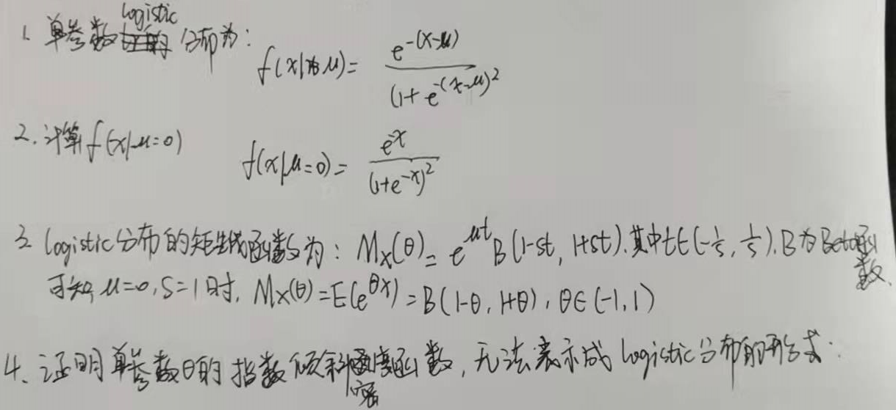
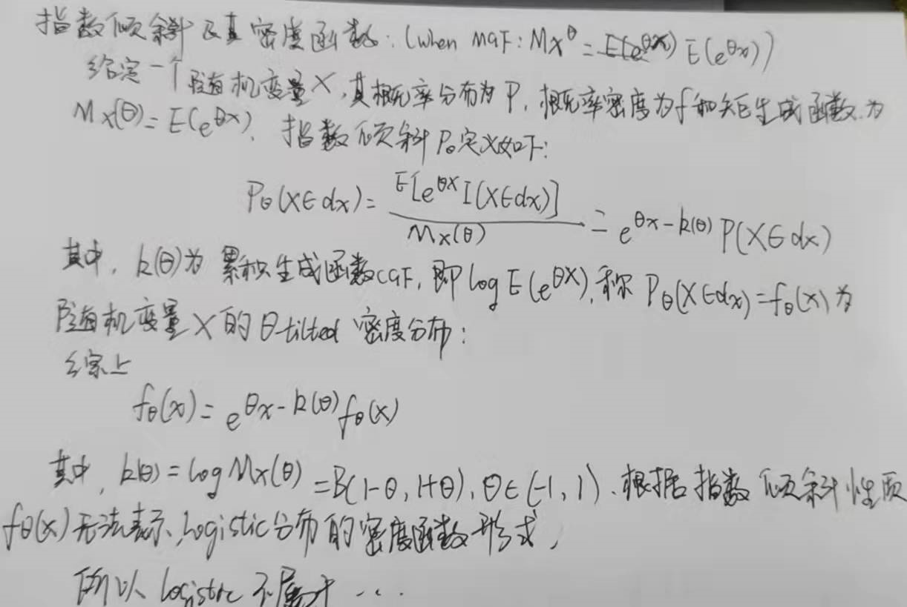
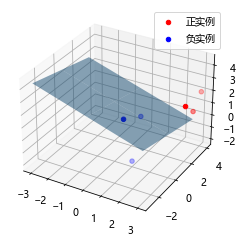
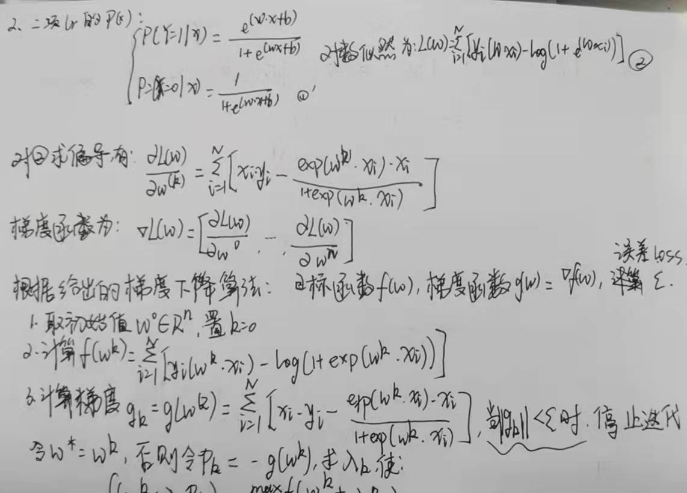
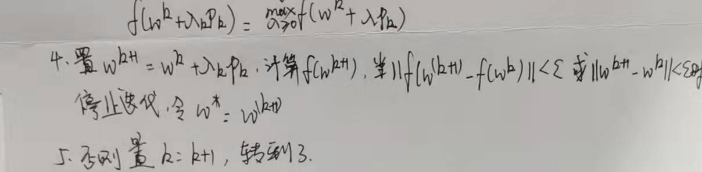

## 笔记：

lr、最大熵模型都属于对数线性模型，常用的最优化算法有改进的迭代尺度法、梯度下降法、牛顿法或拟牛顿法

## 1.逻辑斯谛回归

**1.1 模型介绍定义**

**逻辑斯谛回归**(**logistic regression**)是统计学习中常用的一类分类方法, 是一种线性的两分类的统计学习方法.

通常使用二项逻辑斯谛回归模型(binomial logistic regression model), 由条件概率分布 ![[公式]](https://www.zhihu.com/equation?tex=%5Cmathbf%7BP%7D%28%5Cmathbf%7BY%7D%7C%5Cmathbf%7BX%7D%29) , 形式为参数化的逻辑斯谛分布. 通常为了方便, 将偏移bias项 ![[公式]](https://www.zhihu.com/equation?tex=b) 融合进向量中， 即 ![[公式]](https://www.zhihu.com/equation?tex=w+%3D+%28w%5E%7B%281%29%7D%2Cw%5E%7B%282%29%7D%2C%5Ccdots%2C+w%5E%7B%28n%29%7D%2C+b%29%5ET%2C+x+%3D+%28x%5E%7B%281%29%7D%2Cx%5E%7B%282%29%7D%2C+%5Ccdots%2C+x%5E%7B%28n%29%7D%2C+1%29%5ET) .

此时定义逻辑斯谛回归模型的条件概率分布是:

![[公式]](https://www.zhihu.com/equation?tex=%5Cmathbf%7BP%7D%28%5Cmathbf%7BY%7D%3D1%7CX%29+%3D+%5Cfrac%7B%5Cexp%7B%28w%5Ccdot+x%2Bb%29%7D%7D%7B1%2B%5Cexp%7B%28w%5Ccdot+x%2Bb%29%7D%7D)

![[公式]](https://www.zhihu.com/equation?tex=%5Cmathbf%7BP%7D%28%5Cmathbf%7BY%7D%3D0%7CX%29+%3D+%5Cfrac%7B1%7D%7B1%2B%5Cexp%7B%28w%5Ccdot+x%2Bb%29%7D%7D)

逻辑斯谛回归模型比较这两个概率值的大小, 将实例 ![[公式]](https://www.zhihu.com/equation?tex=x) 分到概率值较大的那一类.

**1.2 线性证明**

逻辑斯谛模型本质是一个线性模型, 虽然它用了指数函数 ![[公式]](https://www.zhihu.com/equation?tex=%5Cexp%7B%7D) 和*sigmoid*函数来使得到一个概率化的输出.

定义一个事件发生的几率(odds)是指该事件发生的概率与该事件不发生的概率的比值. 那么如果一个事件发生的概率为 ![[公式]](https://www.zhihu.com/equation?tex=p) , 该事件的对数几率(log odds)或logit函数是: ![[公式]](https://www.zhihu.com/equation?tex=%5Ctext%7Blogit%7D%28p%29%3D%5Clog%7B%5Cfrac%7Bp%7D%7B1-p%7D%7D)

那么对于逻辑斯谛回归来说: ![[公式]](https://www.zhihu.com/equation?tex=%5Clog%7B%5Cfrac%7B%5Cmathbf%7BP%7D%28%5Cmathbf%7BY%7D%3D1%7Cx%29%29%7D%7B1-%5Cmathbf%7BP%7D%28%5Cmathbf%7BY%7D%3D1%7Cx%29%7D%7D%3Dw%5Ccdot+x) 从这儿我们得证其线性性质.

而逻辑斯谛回归模型将这样一个线性函数 ![[公式]](https://www.zhihu.com/equation?tex=w%5Ccdot+x) 转化为概率:

![[公式]](https://www.zhihu.com/equation?tex=%5Cmathbf%7BP%7D%28%5Cmathbf%7BY%7D%3D1%7Cx%29%3D%5Cfrac%7B%5Cexp%7B%28w%5Ccdot+x%29%7D%7D%7B1%2B%5Cexp%7B%28w%5Ccdot+x%29%7D%7D)

我们希望线性函数的值越接近正无穷 ![[公式]](https://www.zhihu.com/equation?tex=%2B%5Cinfty) , 概率值越接近1. 线性函数值越接近负无穷 ![[公式]](https://www.zhihu.com/equation?tex=-%5Cinfty) , 概率值越接近0.

而*sigmoid*函数 ![[公式]](https://www.zhihu.com/equation?tex=%5Cfrac%7B1%7D%7B1%2Be%5E%7B-x%7D%7D) 正好符合来我们所需要的性质.

Sigmoid函数: 概率输出

**1.3 参数学习**

在具体训练学习参数 ![[公式]](https://www.zhihu.com/equation?tex=w) 时, 我们使用*sigmoid*函数:

![[公式]](https://www.zhihu.com/equation?tex=h%28w%5Ccdot+x%29+%3D+%5Cfrac%7B1%7D%7B1%2Be%5E%7B-w%5Ccdot+x%7D%7D)

为了获得一个**凸损失函数(convex)**为了后续的优化迭代求最值, 我们不能采用线性回归的损失函数, 特此我们定义损失函数如下:

![[公式]](https://www.zhihu.com/equation?tex=%5Cmathbf%7BC%7D%28h%28w%5Ccdot+x%29%2Cy%29+%3D+%5Cbegin%7Bcases%7D+-%5Clog%7B%28h%28w%5Ccdot+x%29%29%7D+%26++y%3D1+%5C%5C+-%5Clog%7B%281-h%28w%5Ccdot+x%29%29%7D+%26+y%3D0+%5C%5C+%5Cend%7Bcases%7D+)

可以化简为

![[公式]](https://www.zhihu.com/equation?tex=%5Cmathbf%7BC%7D%28h%28w%5Ccdot+x%29%2C+y%29+%3D-y%5Clog%7B%28h%28w%5Ccdot+x%29%29%7D+-+%281-y%29%5Clog%7B%281-h%28w%5Ccdot+x%29%29%7D)

我们计算梯度

![[公式]](https://www.zhihu.com/equation?tex=%5Cbegin%7Balign%7D+%5Cfrac%7B%5Cpartial+%5Cmathbf%7BC%7D%28h%28w%5Ccdot+x%29%2Cy%29%7D%7B%5Cpartial+w%7D+%26%3D+%5Cfrac%7B-y%7D%7Bh%28w%5Ccdot+x%29%7Dh%27%28w%5Ccdot+x%29x+-+%281-y%29%5Cfrac%7B-h%27%28w%5Ccdot+x%29x%7D%7B1-h%28w%5Ccdot+x%29%7D%5C%5C+%26%3Dh%27%28w%5Ccdot+x%29x%5B%5Cfrac%7B-y%7D%7Bh%28w%5Ccdot+x%29%7D+%2B%281-y%29%5Cfrac%7B1%7D%7B1-h%28w%5Ccdot+x%29%7D%5D%5C%5C+%26%3D%28h%28w%5Ccdot+x%29+-+y%29x%5C%5C+%5Cend%7Balign%7D)

所以我们得到**批次梯度下降**的公式(**batch gradient descent**):

![[公式]](https://www.zhihu.com/equation?tex=w_%7Bn%2B1%7D+%3D+w_n+-+%5Cfrac%7B%5Calpha%7D%7Bn%7D%5Csum_%7Bi%3D1%7D%5En+%28h%28w%5Ccdot+x_i%29-y_i%29x_i) , ![[公式]](https://www.zhihu.com/equation?tex=%5Calpha) 为学习步长

在具体操作时, 为了更高效快速得迭代最优化, 常采用**随机梯度下降(stochastic graident descent)** 而不是**批次梯度下降**. 在下一节的代码实现中, 为大家带来随机梯度下降的一个示范.

------

**1.4 Python代码实现**

```python
class LRClassifier:
    """
    逻辑斯谛回归
    采用随机梯度下降的优化方法(SGD)
    """
    def __init__(self, max_iter=100, alpha=0.01):
        """
        初始化参数设定
        param: [int] max_iter 最大循环训练次数, Default=100
        param: [float] alpha 
        @ret: None
        """
        self.max_iter = max_iter
        self.alpha = alpha
    
    @staticmethod
    def sigmoid(x):
        """
        Sigmoid函数 定义为class method
        用于将输出归一化至[0,1]的概率区间
        param: [float] x 输入几率odds
        @ret: [float] 概率化结果
        """
        return float(1 / (1 + np.exp(-x)))
    
    @staticmethod
    def join_constant_matrix(dataset):
        """
        将常数偏移项融入数据集中,
        方便之后的向量化运算(注意用到了*拆包运算符)
        param: [np.ndarray] dataset 原始输入数据集
        @ret: [np.ndarray] 并入偏移常数项的数据集
        """
        joined = []
        for x in dataset:
            joined.append([1.0, *x])
        return np.array(joined)       
    
    def fit(self, X, y):
        """
        训练模型, 拟合参数w的主算法
        采用了随机梯度下降(stochastic gradient descent)的思想
        param: X [np.ndarray] 输入训练数据集
        param: y [np.1darray] 输入训练预测值
        @ret: None
        """
        t0 = time.time() # 计时
        print("Starting Training: Logistic Regression(max_iter={},alpha={})".format(self.max_iter, self.alpha))
        X = self.join_constant_matrix(X) # 融入常数偏移项
        self.w = np.zeros((1,len(X[0])), dtype=np.float32) # 初始化权重向量
        for iteration in range(self.max_iter): # 因为采用随机梯度下降
            rand_seq = np.random.randint(low=0, high=len(X), size=len(X)) # 随机生成一个要去pick的index序列
            for pick in rand_seq:
                # 此处要特别小心数清楚 维度
                # 究竟是行向量还是纵向量
                # 改变一点点就很容易报错
                x = X[pick]
                x.shape = (x.shape[0],1)
                y_pred = self.sigmoid(np.dot(self.w,x))
                error = y_pred - y[pick]
                self.w -= self.alpha * error * np.transpose(x)
        t1 = time.time()
        print("Finish Training: time taken={:.4f}s".format(t1-t0))
    
    def score(self, X_test, y_test):
        """
        测试函数
        param: [np.ndarray] X_test 测试数据输入集
        param: [np.1darray] y_test 测试预测值集
        @ret: None 
        """
        correct = 0
        X_test = self.join_constant_matrix(X_test)
        for x,y in zip(X_test, y_test):
            y_pred = np.dot(self.w, x)
            if (y_pred > 0 and y == 1) or (y_pred < 0 and y == 0):
                correct += 1
        print("预测成功率为: {:.2f}%".format(100*correct/len(X_test)))
    
```

训练完成后, 我们进行可视化, 发现确实很好的将数据集划分了开来.

逻辑斯谛回归: 可视化

------

## 2. 最大熵模型

**2.1 最大熵原理定义**

**最大熵模型(maximum entropy model)**由最大熵原理推导实现. 该原理认为, 学习概率模型时, 在所有可能的概率模型(分布)中, 熵最大的模型是最好的模型. 通常用约束条件来确定概率模型的集合, 所以最大熵原理也表示为在满足约束条件的模型集合中选取熵最大的模型.

假设分类模型时一个条件概率分布 ![[公式]](https://www.zhihu.com/equation?tex=%5Cmathbf%7BP%7D%28%5Cmathbf%7BY%7D%7C%5Cmathbf%7BX%7D%29) , 给定训练数据集 ![[公式]](https://www.zhihu.com/equation?tex=T%3D%5C%7B%28x_1%2Cy_1%29%2C%28x_2%2Cy_2%29%2C%5Ccdots%2C%28x_N%2Cy_N%29%5C%7D) , 目标是用最大熵原理选择最好的分类模型.

由训练数据集 ![[公式]](https://www.zhihu.com/equation?tex=T) 中, 我们可以获得经验分布

![[公式]](https://www.zhihu.com/equation?tex=%5Chat%7B%5Cmathbf%7BP%7D%7D%28%5Cmathbf%7BX%7D%3Dx%2C%5Cmathbf%7BY%7D%3Dy%29+%3D+%5Cfrac%7B%5Csum%5Cmathbb%7BI%7D%28%5Cmathbf%7BX%7D%3Dx%2C%5Cmathbf%7BY%7D%3Dy%29%7D%7BN%7D) **联合分布**

![[公式]](https://www.zhihu.com/equation?tex=%5Chat%7B%5Cmathbf%7BP%7D%7D%28%5Cmathbf%7BX%7D%3Dx%29%3D%5Cfrac%7B%5Csum%5Cmathbb%7BI%7D%28%5Cmathbf%7BX%7D%3Dx%29%7D%7BN%7D) **边缘分布**

> **定义(最大熵模型): 假设满足所有约束条件的模型集合为 ![[公式]](https://www.zhihu.com/equation?tex=C%3D%5C%7BP%5Cin+%5Cmathbf%7BP%7D%5C%7C+E_P%28f_i%29%3DE_%7B%5Chat%7Bp%7D%7D%28f_i%29%2C+i%3D1%2C2%2C%5Ccdots%2Cn%5C%7D) 定义在条件概率分布 ![[公式]](https://www.zhihu.com/equation?tex=%5Cmathbf%7BP%7D%28%5Cmathbf%7BY%7D%7C%5Cmathbf%7BX%7D%29) 上的条件熵为 ![[公式]](https://www.zhihu.com/equation?tex=H%28P%29+%3D+-%5Csum_%7Bx%2Cy%7D%5Chat%7BP%7D%28x%29P%28y%7Cx%29%5Clog+P%28y%7Cx%29)**
> **则模型集合 ![[公式]](https://www.zhihu.com/equation?tex=C) 中条件熵 ![[公式]](https://www.zhihu.com/equation?tex=H%28P%29) 最大的模型称为最大熵模型. 式中的对数为自然对数.**

**2.2 最大熵模型的学习**

按最优化问题的习惯, 将求最大值问题改写为等价的求最小值问题后, 目标即是:

![[公式]](https://www.zhihu.com/equation?tex=%5Cmin_%7BP%5Cin+C%7D+-H%28P%29%3D%5Csum_%7Bx%2Cy%7D%5Chat%7BP%7D%28x%29P%28y%7Cx%29%5Clog+P%28y%7Cx%29)

![[公式]](https://www.zhihu.com/equation?tex=%5Ctext%7Bs.t.+%7DE_P%28f_i%29-E_%7B%5Chat%7BP%7D%7D%28f_i%29+%3D+0%2C%5Cquad+i%3D1%2C2%2C%5Ccdots%2Cn)

![[公式]](https://www.zhihu.com/equation?tex=%5Ctext%7Band++%7D+%5Csum_%7By%7DP%28y%7Cx%29%3D1)

将有约束的最优化原始问题转换为无约束最优化的对偶问题. 引入**拉格朗日乘子** ![[公式]](https://www.zhihu.com/equation?tex=w_0%2Cw_1%2C%5Ccdots%2Cw_n) , 定义拉格朗日函数 ![[公式]](https://www.zhihu.com/equation?tex=L%28P%2Cw%29) :

![[公式]](https://www.zhihu.com/equation?tex=%5Cbegin%7Balign%2A%7D+L%28P%2Cw%29+%26%3D+-H%28P%29%2Bw_0%5CBig%281-%5Csum_y+P%28y%7Cx%29%5CBig%29%2B%5Csum_%7Bi%3D1%7D%5En+w_i%28E_%7B%5Chat%7BP%7D%7D%28f_i%29-E_P%28f_i%29%29+%5C%5C+%26%3D+%5Csum_%7Bx%2Cy%7D%5Chat%7BP%7D%28x%29P%28y%7Cx%29%5Clog+P%28y%7Cx%29+%2B+w_0%5CBig%281-%5Csum_y+P%28y%7Cx%29%5CBig%29%5C%5C+%26+%2B%5Csum_%7Bi%3D1%7D%5Enw_i%5CBig%28%5Csum_%7Bx%2Cy%7D%5Chat%7BP%7D%28x%2Cy%29f_i%28x%2Cy%29-%5Csum_%7Bx%2Cy%7D%5Chat%7BP%7D%28x%29P%28y%7Cx%29f_i%28x%2Cy%29%5CBig%29+%5C%5C+%5Cend%7Balign%2A%7D)

最优化的原始问题和转化后的对偶问题是:

![[公式]](https://www.zhihu.com/equation?tex=%5Ctext%7B%E5%8E%9F%E5%A7%8B+%7D+%5Cmin_%7BP%5Cin+C%7D%5Cmax_%7Bw%7DL%28P%2Cw%29+%5Csim+%5Ctext%7B%E5%AF%B9%E5%81%B6+%7D+%5Cmax_%7Bw%7D%5Cmin_%7BP%5Cin+C%7DL%28P%2Cw%29)

**2.3 极大似然等价化**

通过复杂的计算, 可以证明**对偶函数的极大化等价于最大熵模型的极大似然股估计**. 这样, 最大熵模型的学习问题就转换为具体求解对数似然函数极大化或对偶函数最大化的问题.

可以将最大熵模型写成更一般的形式:

![[公式]](https://www.zhihu.com/equation?tex=P_w%28y%7Cx%29+%3D+%5Cfrac%7B1%7D%7BZ_w%28x%29%7D%5Cexp%5CBig%28%5Csum_%7Bi%3D1%7D%5Enw_if_i%28x%2Cy%29%5CBig%29) , 其中![[公式]](https://www.zhihu.com/equation?tex=Z_w%28x%29%3D%5Csum_y+%5Cexp%5CBig%28%5Csum_%7Bi%3D1%7D%5En+w_if_i%28x%2Cy%29%5CBig%29)

## 1.确认Logistic分布属于指数分布族。






代码来自：[第6章 Logistic回归与最大熵模型](https://datawhalechina.github.io/statistical-learning-method-solutions-manual/#/chapter06/chapter06?id=习题61)

```python
from scipy.optimize import fminbound
from pylab import mpl
import numpy as np
import matplotlib.pyplot as plt
%matplotlib inline

# 图像显示中文
mpl.rcParams['font.sans-serif'] = ['Microsoft YaHei']


class MyLogisticRegression:
    def __init__(self, max_iter=10000, distance=3, epsilon=1e-6):
        """
        Logistic回归
        :param max_iter: 最大迭代次数 
        :param distance: 一维搜索的长度范围
        :param epsilon: 迭代停止阈值
        """
        self.max_iter = max_iter
        self.epsilon = epsilon
        # 权重
        self.w = None
        self.distance = distance
        self._X = None
        self._y = None

    @staticmethod
    def preprocessing(X):
        """将原始X末尾加上一列，该列数值全部为1"""
        row = X.shape[0]
        y = np.ones(row).reshape(row, 1)
        return np.hstack((X, y))

    @staticmethod
    def sigmod(x):
        return 1 / (1 + np.exp(-x))

    def grad(self, w):
        z = np.dot(self._X, w.T)
        grad = self._X * (self._y - self.sigmod(z))
        grad = grad.sum(axis=0)
        return grad

    def like_func(self, w):
        z = np.dot(self._X, w.T)
        f = self._y * z - np.log(1 + np.exp(z))
        return np.sum(f)

    def fit(self, data_x, data_y):
        self._X = self.preprocessing(data_x)
        self._y = data_y.T
        # （1）取初始化w
        w = np.array([[0] * self._X.shape[1]], dtype=np.float)
        k = 0
        # （2）计算f(w)
        fw = self.like_func(w)
        for _ in range(self.max_iter):
            # 计算梯度g(w)
            grad = self.grad(w)
            # （3）当梯度g(w)的模长小于精度时，停止迭代
            if (np.linalg.norm(grad, axis=0, keepdims=True) < self.epsilon).all():
                self.w = w
                break

            # 梯度方向的一维函数
            def f(x):
                z = w - np.dot(x, grad)
                return -self.like_func(z)

            # （3）进行一维搜索，找到使得函数最大的lambda
            _lambda = fminbound(f, -self.distance, self.distance)

            # （4）设置w(k+1)
            w1 = w - np.dot(_lambda, grad)
            fw1 = self.like_func(w1)

            # （4）当f(w(k+1))-f(w(k))的二范数小于精度，或w(k+1)-w(k)的二范数小于精度
            if np.linalg.norm(fw1 - fw) < self.epsilon or \
                    (np.linalg.norm((w1 - w), axis=0, keepdims=True) < self.epsilon).all():
                self.w = w1
                break

            # （5） 设置k=k+1
            k += 1
            w, fw = w1, fw1

        self.grad_ = grad
        self.n_iter_ = k
        self.coef_ = self.w[0][:-1]
        self.intercept_ = self.w[0][-1]

    def predict(self, x):
        p = self.sigmod(np.dot(self.preprocessing(x), self.w.T))
        p[np.where(p > 0.5)] = 1
        p[np.where(p < 0.5)] = 0
        return p

    def score(self, X, y):
        y_c = self.predict(X)
        # 计算准确率
        error_rate = np.sum(np.abs(y_c - y.T)) / y_c.shape[0]
        return 1 - error_rate

    def draw(self, X, y):
        # 分隔正负实例点
        y = y[0]
        X_po = X[np.where(y == 1)]
        X_ne = X[np.where(y == 0)]
        # 绘制数据集散点图
        ax = plt.axes(projection='3d')
        x_1 = X_po[0, :]
        y_1 = X_po[1, :]
        z_1 = X_po[2, :]
        x_2 = X_ne[0, :]
        y_2 = X_ne[1, :]
        z_2 = X_ne[2, :]
        ax.scatter(x_1, y_1, z_1, c="r", label="正实例")
        ax.scatter(x_2, y_2, z_2, c="b", label="负实例")
        ax.legend(loc='best')
        # 绘制透明度为0.5的分隔超平面
        x = np.linspace(-3, 3, 3)
        y = np.linspace(-3, 3, 3)
        x_3, y_3 = np.meshgrid(x, y)
        a, b, c, d = self.w[0]
        z_3 = -(a * x_3 + b * y_3 + d) / c
        # 调节透明度
        ax.plot_surface(x_3, y_3, z_3, alpha=0.5)
        plt.show()
```

```python
# 训练数据集
X_train = np.array([[3, 3, 3], [4, 3, 2], [2, 1, 2], [1, 1, 1], [-1, 0, 1], [2, -2, 1]])
y_train = np.array([[1, 1, 1, 0, 0, 0]])
# 构建实例，进行训练
clf = MyLogisticRegression(epsilon=1e-6)
clf.fit(X_train, y_train)
clf.draw(X_train, y_train)
print("迭代次数：{}次".format(clf.n_iter_))
print("梯度：{}".format(clf.grad_))
print("权重：{}".format(clf.w[0]))
print("模型准确率：%0.2f%%" % (clf.score(X_train, y_train) * 100))
```



```markup
迭代次数：2095次
梯度：[ 7.33881397e-05  2.44073067e-05  2.52604176e-04 -5.13424350e-04]
权重：[  4.34496173   2.05340452   9.64074166 -22.85079478]
模型准确率：100.00%
```

## 2.写出lr的gd算法





## 3.写出最大熵模型学习的DFP算法。（关于一般的DFP算法参见附录B）

暂时超出能力范围了..元旦更新完QAQ