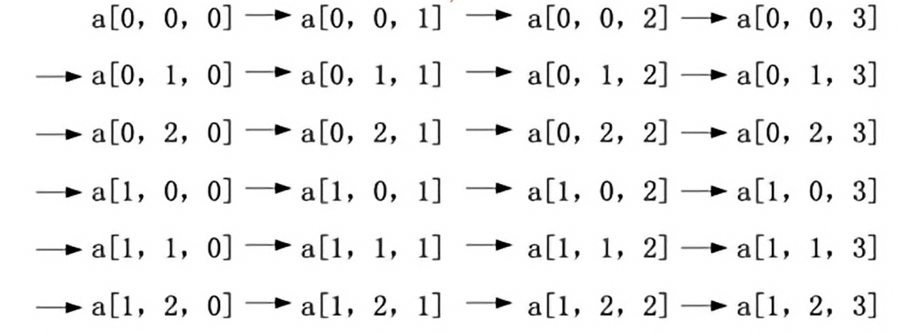

# 数组的存储

例如：

```cpp
int c[i][j][k];
int i = c[x,y,z];
```

存储空间为b，计算地址公式：

```
Loc(i=c[x,y,z])=x \cdot j \cdot k \cdot b+y\cdot k\cdot b+ z\cdot b
```



### [移除元素](https://tianchi.aliyun.com/oj/problems/aehayfm87hpoizhs?spm=5176.15228502.0.0.30a279bft1p7vl)

思路：

> 使用两个指针 left，right。left 指向处理好的非 val 值元素数组的尾部，right 指针指向当前待处理元素。
>
> 不断向右移动 right 指针，每次移动到非 val 值的元素，则将左右指针对应的数交换，交换同时将 left 右移。
>
> 这样就将非 val 值的元素进行前移，left 指针左边均为处理好的非 val 值元素，而从 left 指针指向的位置开始， right 指针左边都为 val 值。
>
> 遍历结束之后，则所有 val 值元素都移动到了右侧，且保持了非零数的相对位置。此时 left 就是新数组的长度。

```python
class Solution:
    def removeElement(self, nums: List[int], val: int) -> int:
        left = 0
        right = 0
        while right < len(nums):
            if nums[right] != val:
                nums[left], nums[right] = nums[right], nums[left]
                left += 1
            right += 1
        return left
```

### [删除有序数组中的重复项](https://leetcode-cn.com/problems/remove-duplicates-from-sorted-array/)

> 1. 因为数组是有序的，那么重复的元素一定会相邻。
>
>    删除重复元素，实际上就是将不重复的元素移到数组左侧。考虑使用双指针。具体算法如下：
>
>    1. 定义两个快慢指针 `slow`，`fast`。其中 `slow` 指向去除重复元素后的数组的末尾位置。`fast` 指向当前元素。
>
>    2. 令 `slow` 在后， `fast` 在前。令 `slow = 0`，`fast = 1`。
>
>    3. 比较 
>
>       ```
>       slow
>       ```
>
>        位置上元素值和 
>
>       ```
>       fast
>       ```
>
>        位置上元素值是否相等。
>
>       - 如果不相等，则将 `slow` 后移一位，将 `fast` 指向位置的元素复制到 `slow` 位置上。
>
>    4. 将 `fast` 右移 `1` 位。
>
>    - 重复上述 3 ~ 4 步，直到 `fast` 等于数组长度。
>    - 返回 `slow + 1` 即为新数组长度。

```py
class Solution:
    def removeDuplicates(self, nums: List[int]) -> int:
        left = 0
        for right in range(len(nums)):
            # 如果相等, 说明right指向的元素是重复元素，不保留
            if nums[right] == nums[left]:
                continue

            # 如果不相等, 说明right指向的元素不是重复元素，保留，然后右移left一个单位，再把right的值赋给left
            left += 1
            nums[left] = nums[right]
        return left + 1
```

### [三数之和](https://leetcode-cn.com/problems/3sum/)

思路：

> 直接三重遍历查找 a、b、c 的时间复杂度是：。我们可以通过一些操作来降低复杂度。
>
> 先将数组进行排序，以保证按顺序查找 a、b、c 时，元素值为升序，从而保证所找到的三个元素是不重复的。同时也方便下一步使用双指针减少一重遍历。时间复杂度为：
>
> 第一重循环遍历 a，对于每个 a 元素，从 a 元素的下一个位置开始，使用双指针 left，right。left 指向 a 元素的下一个位置，right 指向末尾位置。先将 left 右移、right 左移去除重复元素，再进行下边的判断。
>
> - 若 `nums[a] + nums[left] + nums[right] = 0`，则得到一个解，将其加入答案数组中，并继续将 left 右移，right 左移；
> - 若 `nums[a] + nums[left] + nums[right] > 0`，说明 nums[right] 值太大，将 right 向左移；
> - 若 `nums[a] + nums[left] + nums[right] < 0`，说明 nums[left] 值太小，将 left 右移。ython

```python
class Solution:
    def threeSum(self, nums: List[int]) -> List[List[int]]:
        n = len(nums)
        nums.sort()
        ans = []

        for i in range(n):
            if i > 0 and nums[i] == nums[i-1]:
                continue
            left = i + 1
            right = n - 1
            while left < right:
                while left < right and left > i + 1 and nums[left] == nums[left-1]:
                    left += 1
                while left < right and right < n - 1 and nums[right+1] == nums[right]:
                    right -= 1
                if left < right and nums[i] + nums[left] + nums[right] == 0:
                    ans.append([nums[i], nums[left], nums[right]])
                    left += 1
                    right -= 1
                elif nums[i] + nums[left] + nums[right] > 0:
                    right -= 1
                else:
                    left += 1
        return ans
```

