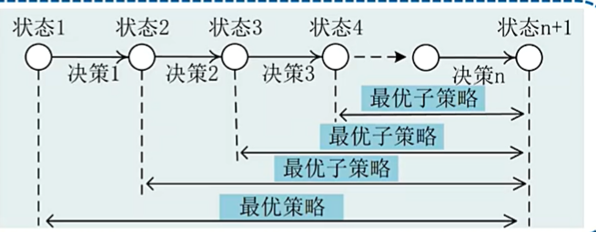

# 动态规划DP

动态规划难懂又难做

## dp问题特点：

- 多个阶段
- 每个阶段有多种策略
- 当前的阶段状态确定后，在这之后的决策不受前n-1个决策的影响

## 贝尔曼最优化原理：

作为一个全过程的最优策略具有这样的性质:无论初始状态和初始决策如何,对于先前决策所形成的状态而言，其后的所有决策必构成个最优子策略

总结：

1. 最优子结构如上图
2. 无后效，当前状态对之后状态无效果
3. 对过程存储，上图的0-1、1-2、2-3都记录下来

