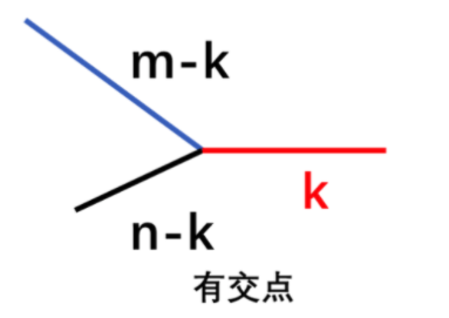
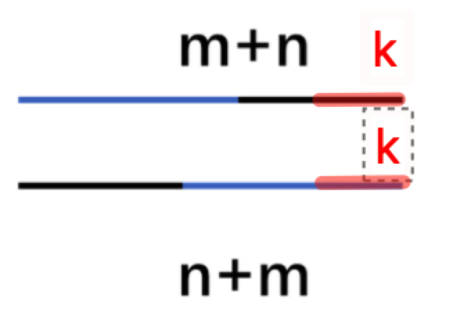

# 链表

**链表（Linked List）**：一种线性表数据结构。它使用一组任意的存储单元（可以是连续的，也可以是不连续的），来存储一组具有相同类型的数据。

一般除了单链表，还有双向链表跟循环链表。

增删改查里面，只有查不快。

一般有：

- 排序
- 双指针

### [21. 合并两个有序链表 - 力扣（LeetCode） (leetcode-cn.com)](https://leetcode-cn.com/problems/merge-two-sorted-lists/)

思路：

> 利用归并排序的思想。
>
> 创建一个新的链表节点作为头节点（记得保存），然后判断 `l1` 和 `l2` 头节点的值，将较小值的节点添加到新的链表中。
>
> 当一个节点添加到新的链表中之后，将对应的 `l1` 或 `l2` 链表向后移动一位。
>
> 然后继续判断当前 `l1` 节点和当前 `l2` 节点的值，继续将较小值的节点添加到新的链表中，然后将对应的链表向后移动一位。
>
> 这样，当 `l1` 或 `l2` 遍历到最后，最多有一个链表还有节点未遍历，则直接将该节点链接到新的链表尾部即可。

代码：

```Python
class Solution:
    def mergeTwoLists(self, l1: ListNode, l2: ListNode) -> ListNode:
        newHead = ListNode(-1)

        curr = newHead
        while l1 and l2:
            if l1.val <= l2.val:
                curr.next = l1
                l1 = l1.next
            else:
                curr.next = l2
                l2 = l2.next
            curr = curr.next

        curr.next = l1 if l1 is not None else l2

        return newHead.next
```

### [160. 相交链表 - 力扣（LeetCode） (leetcode-cn.com)](https://leetcode-cn.com/problems/intersection-of-two-linked-lists/)

思路：

> 如果两个链表相交，那么从相交位置开始，到结束，必有一段等长且相同的节点。假设链表 A 的长度为 m、链表 B 的长度为 n，他们的相交序列有 k 个，则相交情况可以如下如所示：
>
> 
>
> 现在问题是如何找到 m-k 或者 n-k 的位置。
>
> 考虑将链表 A 的末尾拼接上链表 B，链表 B 的末尾拼接上链表 A。
>
> 然后使用两个指针 pA 、PB，分别从链表 A、链表 B 的头节点开始遍历，如果走到共同的节点，则返回该节点。
>
> 否则走到两个链表末尾，返回 None。
>
> 

代码：

```Python
class Solution:
    def getIntersectionNode(self, headA: ListNode, headB: ListNode) -> ListNode:
        if headA == None or headB == None:
            return None
        pA = headA
        pB = headB
        while pA != pB :
            pA = pA.next if pA != None else headB
            pB = pB.next if pB != None else headA
        return pA
```

### [82. *删除排序链表中的重复元素 II - 力扣（LeetCode） (leetcode-cn.com)](https://leetcode-cn.com/problems/remove-duplicates-from-sorted-list-ii/)

思路：

> 一次遍历，是说一边遍历、一边统计相邻节点的值是否相等，如果值相等就继续后移找到值不等的位置，然后删除值相等的这个区间。
>
> 其实思路很简单，跟递归方法中的 while 语句跳过所有值相等的节点的思路是一样的：如果 cur.val == cur.next.val  说明两个相邻的节点值相等，所以继续后移，一直找到 cur.val != cur.next.val  ，此时的 cur.next  就是值不等的节点。
>
> 比如： 1 -> 2 -> 2 -> 2 -> 3，我们用一个 pre 指向 1；当 cur 指向第一个 2 的时候，发现 cur.val == cur.next.val  ，所以出现了值重复的节点啊，所以 cur 一直后移到最后一个 2 的时候，发现 cur.val != cur.next.val  ，此时 cur.next = 3 ，所以 pre.next = cur.next ，即让1 的 next 节点是 3，就把中间的所有 2 都删除了。
> 代码中用到了一个常用的技巧：dummy 节点，也叫做 哑节点。它在链表的迭代写法中非常常见，因为对于本题而言，我们可能会删除头结点 head，为了维护一个不变的头节点，所以我们添加了 dummy，让dummy.next = head，这样即使 head 被删了，那么会操作 dummy.next 指向新的链表头部，所以最终返回的也是 dummy.next。
>
> 来源：[力扣（LeetCode）](leetcode-cn.com/problems/remove-duplicates-from-sorted-list-ii/solution/fu-xue-ming-zhu-di-gui-die-dai-yi-pian-t-wy0h)

```python
class Solution(object):
    def deleteDuplicates(self, head):
        if not head or not head.next:
            return head
        dummy = ListNode(0)
        dummy.next = head
        pre = dummy
        cur = head
        while cur:
            # 跳过当前的重复节点，使得cur指向当前重复元素的最后一个位置
            while cur.next and cur.val == cur.next.val:
                cur = cur.next
            if pre.next == cur:
                 # pre和cur之间没有重复节点，pre后移
                pre = pre.next
            else:
                # pre->next指向cur的下一个位置（相当于跳过了当前的重复元素）
                # 但是pre不移动，仍然指向已经遍历的链表结尾
                pre.next = cur.next
            cur = cur.next
        return dummy.next
```

