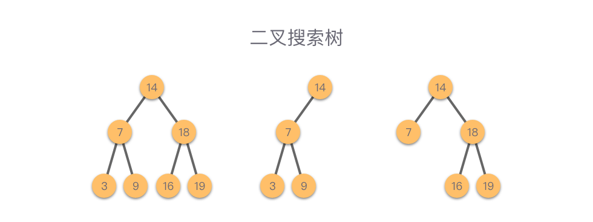

### 特殊二叉树

**满二叉树（Full Binary Tree）**：如果所有分支节点都存在左子树和右子树，并且所有叶子节点都在同一层上，则称该二叉树为满二叉树。

- 叶子节点只出现在最下面一层。
- 非叶子节点的度一定为 `2`。
- 在同等深度的二叉树中，满二叉树的节点个数最多，叶子节点个数最多。


**完全二叉树（Complete Binary Tree）**：如果叶子节点只能出现在最下面两层，并且最下层的叶子节点都依次排列在该层最左边的位置上，具有这种特点的二叉树称为完全二叉树。

- 叶子节点只能出现在最下面两层。
- 最下层的叶子节点一定集中在该层最左边的位置上。
- 倒数第二层如果有叶子节点，则该层的叶子节点一定集中在右边的位置上。
- 如果节点的度为 `1`，则该节点只偶遇左孩子节点，即不存在只有右子树的情况。
- 同等节点数的二叉树中，完全二叉树的深度最小。


**二叉搜索树（Binary Search Tree）**：也叫做二叉查找树、有序二叉树或者排序二叉树。是指一棵空树或者具有下列性质的二叉树：

- 如果任意节点的左子树不为空，则左子树上所有节点的值均小于它的根节点的值。
- 如果任意节点的右子树不为空，则右子树上所有节点的值均大于它的根节点的值。
- 任意节点的左子树、右子树均为二叉搜索树。



**平衡二叉搜索树（Balanced Binary Tree）**：一种结构平衡的二叉搜索树。即叶节点高度差的绝对值不超过 `1`，并且左右两个子树都是一棵平衡二叉搜索树。平衡二叉树可以在 O(logn) 内完成插入、查找和删除操作。


### 遍历

如果限制先左子树后右子树的遍历顺序，则总共有 `3` 种遍历方式：分别为 **「二叉树的前序遍历」**、**「二叉树的中序遍历」** 和 **「二叉树的后续遍历」**。

而如果使用广度优先搜索的方式，则可以按照层序方式（按照层次从上至下，每一层从左至右）对二叉树进行遍历，这种方式叫做 **「二叉树的层序遍历」**。


## [111. 二叉树的最小深度](https://leetcode-cn.com/problems/minimum-depth-of-binary-tree/) 

## 思路：

深度优先搜索递归遍历左右子树，记录最小深度。

对于每一个非叶子节点，计算其左右子树的最小叶子节点深度，将较小的深度+1 即为当前节点的最小叶子节点深度。

```Python
class Solution:
    def minDepth(self, root: TreeNode) -> int:
        # 遍历到空节点，直接返回 0
        if root == None:
            return 0

        # 左右子树为空，说明为叶子节点 返回 1
        if root.left == None and root.right == None:
            return 1

        leftHeight = self.minDepth(root.left)
        rightHeight = self.minDepth(root.right)

        # 当前节点的左右子树的最小叶子节点深度
        min_depth = 0xffffff
        if root.left:
            min_depth = min(leftHeight, min_depth)
        if root.right:
            min_depth = min(rightHeight, min_depth)

        # 当前节点的最小叶子节点深度
        return min_depth + 1
```

## [112. 路径总和](https://leetcode-cn.com/problems/path-sum/)

## 思路：

递归求解。新增一个变量 currSum，表示为从根节点到当前节点的路径上所有节点值之和。递归遍历左右子树，同时更新维护 currSum 值。

当当前节点为叶子节点时，判断 currSum 是否与 targetSum 相等，否则继续遍历左右子树。

```Python
class Solution:
    def hasPathSum(self, root: TreeNode, targetSum: int) -> bool:
        return self.sum(root, targetSum, 0)

    def sum(self, root: TreeNode, targetSum: int, curSum:int) -> bool:
        if root == None:
            return False
        curSum += root.val
        if root.left == None and root.right == None:
            return curSum == targetSum
        else:
            return self.sum(root.left, targetSum, curSum) or self.sum(root.right, targetSum, curSum)
```