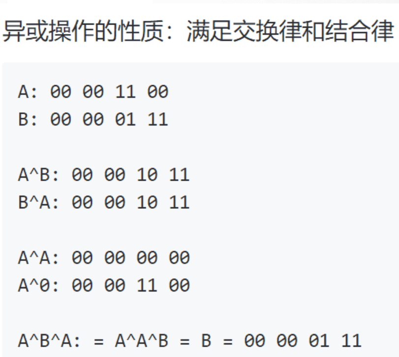

# 位运算

二进制有三种不同表现形式：

- 原码：一个数的二进制形式；

- 反码：正数的反码不变，负数的符号位不变，按位取反；

- 补码：正数的补码不变，负数是反码+1，*计算机中用补码表示*。

- `<<`：

  11<<x：相当于*2的x次方

- `>>`:

​		11<<x：相当于/2的x次方

**特殊的异或：**

A^A: 00 00 00 00
A^0: 00 00 11 00

**结合律：**A^B^A:= A^A^B=B=00 00 01 11

