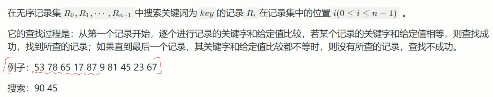
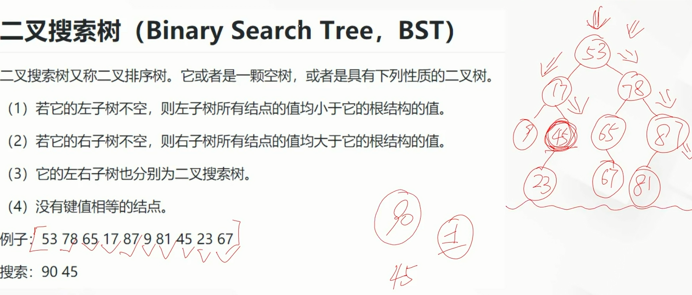
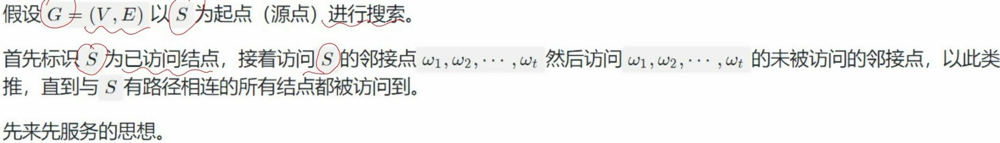
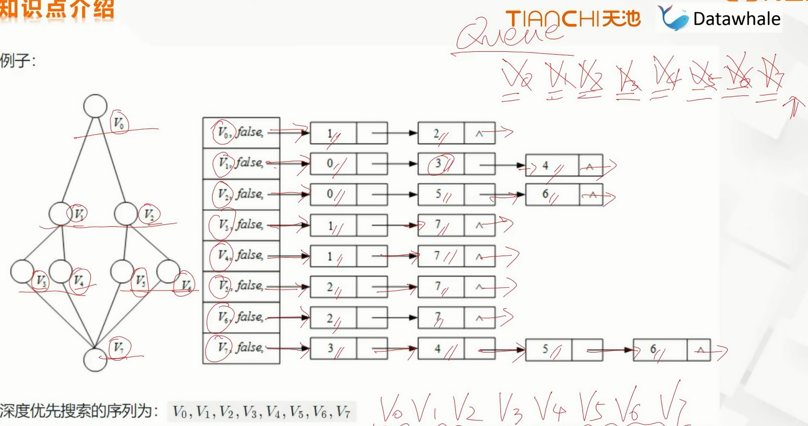
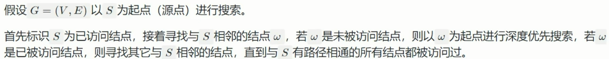
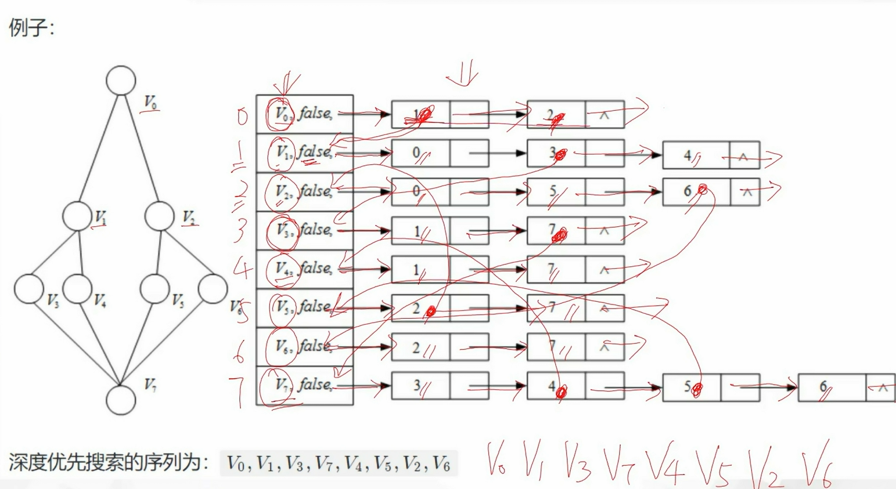

# 搜索

## 查找

### 无序

- 顺序搜索

  

- 二叉搜索树

  

  根据二叉搜索树的特点进行加速查找

### 有序

- 二分搜索

  以双指针例

## 遍历

### 广度搜索（队列的应用）





### 深度搜索（栈的应用）





### 例题

1. [94. 二叉树的中序遍历](https://leetcode-cn.com/problems/binary-tree-inorder-traversal/) 

栈迭代遍历：

> 二叉树的前序遍历递归实现的过程，实际上就是调用系统栈的过程。我们也可以使用一个显式栈 `stack` 来模拟递归的过程。
>
> 前序遍历的顺序为：根节点 - 左子树 - 右子树，而根据栈的「先入后出」特点，所以入栈的顺序应该为：先放入右子树，再放入左子树。这样可以保证最终遍历顺序为前序遍历顺序。
>
> 二叉树的前序遍历显式栈实现步骤如下：
>
> 1. 判断二叉树是否为空，为空则直接返回。
> 2. 初始化维护一个栈，将根节点入栈。
> 3. 当栈不为空时：
>    1. 弹出栈顶元素 `node`，并访问该元素。
>    2. 如果 `node` 的右子树不为空，则将 `node` 的右子树入栈。
>    3. 如果 `node` 的左子树不为空，则将 `node` 的左子树入栈。

```Python
class Solution:
    def inorderTraversal(self, root: Optional[TreeNode]) -> List[int]:
        if not root:                # 二叉树为空直接返回
            return []
        
        res = []
        stack = []

        while root or stack:        # 根节点或栈不为空
            while root:
                stack.append(root)  # 将当前树的根节点入栈
                root = root.left    # 找到最左侧节点
            
            node = stack.pop()      # 遍历到最左侧，当前节点无左子树时，将最左侧节点弹出
            res.append(node.val)    # 访问该节点
            root = node.right       # 尝试访问该节点的右子树
        return res
```

2. [110. 平衡二叉树](https://leetcode-cn.com/problems/balanced-binary-tree/)

> 递归遍历二叉树。先递归遍历左右子树，判断左右子树是否平衡，再判断以当前节点为根节点的左右子树是否平衡。
>
> 如果遍历的子树是平衡的，则返回它的高度，否则返回 -1。
>
> 只要出现不平衡的子树，则该二叉树一定不是平衡二叉树。

```Python
class Solution:
    def isBalanced(self, root: TreeNode) -> bool:
        def height(root: TreeNode) -> int:
            if root == None:
                return False
            leftHeight = height(root.left)
            rightHeight = height(root.right)
            if leftHeight == -1 or rightHeight == -1 or abs(leftHeight-rightHeight) > 1:
                return -1
            else:
                return max(leftHeight, rightHeight)+1
        return height(root) >= 0
```

