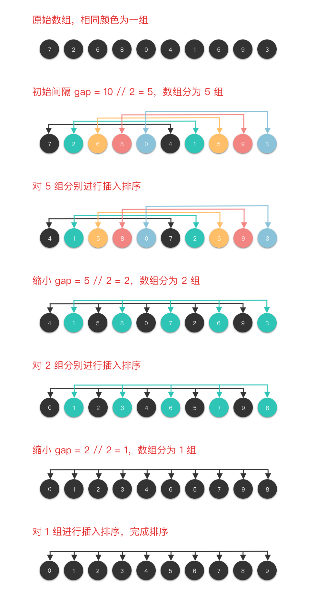
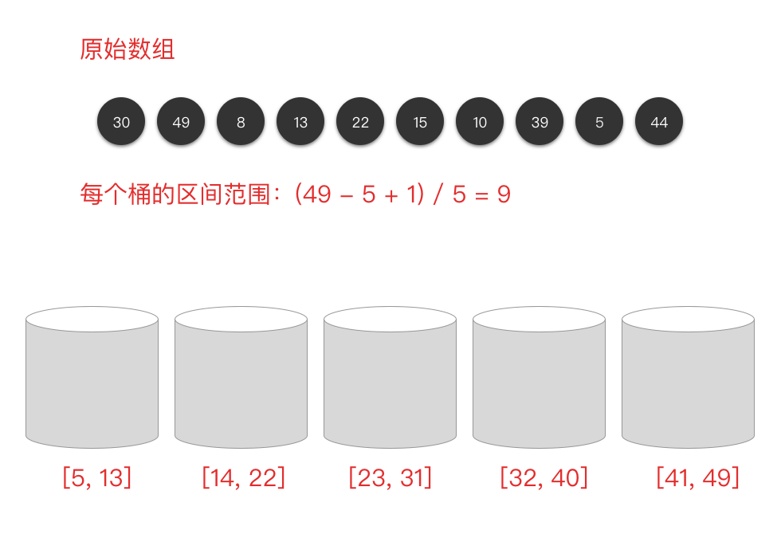
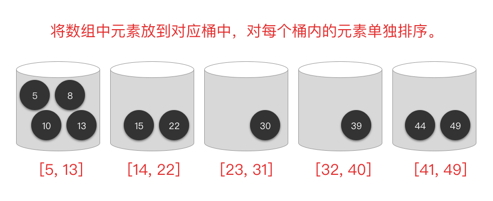
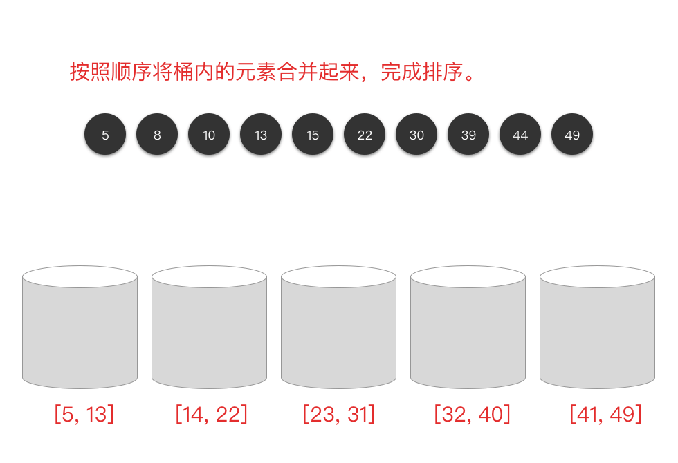

# 排序

## 冒泡排序

### 冒泡排序算法思想

> 冒泡排序（Bubble Sort）基本思想：
>
> 第 `i (i = 1，2，… )` 趟排序时从序列中前 `n - i + 1` 个元素的第 `1` 个元素开始，相邻两个元素进行比较，若前者大于后者，两者交换位置，否则不交换。

冒泡排序法是通过相邻元素之间的比较与交换，使值较小的元素逐步从后面移到前面，值较大的元素从前面移到后面，就像水底的气泡一样向上冒，故称这种排序方法为冒泡排序法。


```Python
class Solution:
    def bubbleSort(self, arr):
        for i in range(len(arr)):
            for j in range(len(arr) - i - 1):
                if arr[j] > arr[j + 1]:
                    arr[j], arr[j + 1] = arr[j + 1], arr[j]

        return arr

    def sortArray(self, nums: List[int]) -> List[int]:
        return self.bubbleSort(nums)
```

## 选择排序

### 选择排序算法思想

> 选择排序（Selection Sort）基本思想：
>
> 第 `i` 趟排序从序列的后 `n − i + 1 (i = 1, 2, …, n − 1)` 个元素中选择一个值最小的元素与该 `n - i + 1` 个元素的最前面那个元素交换位置，即与整个序列的第 `i` 个位置上的元素交换位置。如此下去，直到 `i == n − 1`，排序结束。

可以简述为：每一趟排序中，从剩余未排序元素中选择一个最小的元素，与未排好序的元素最前面的那个元素交换位置。


```Python
class Solution:
    def selectionSort(self, arr):
        for i in range(len(arr) - 1):
            # 记录未排序序列中最小数的索引
            min_i = i
            for j in range(i + 1, len(arr)):
                if arr[j] < arr[min_i]:
                    min_i = j
            # 如果找到最小数，将 i 位置上元素与最小数位置上元素进行交换
            if i != min_i:
                arr[i], arr[min_i] = arr[min_i], arr[i]
        return arr

    def sortArray(self, nums: List[int]) -> List[int]:
        return self.selectionSort(nums)
```

## 插入排序 

### 插入排序算法思想

> 插入排序（Insertion Sort）基本思想：
>
> 将整个序列切分为两部分：前 `i - 1` 个元素是有序序列，后 `n - i + 1` 个元素是无序序列。每一次排序，将无序序列的首元素，在有序序列中找到相应的位置并插入。

可以简述为：每一趟排序中，将剩余无序序列的第一个元素，插入到有序序列的适当位置上。


```Python
class Solution:
    def insertionSort(self, arr):
        for i in range(1, len(arr)):
            temp = arr[i]
            j = i
            while j > 0 and arr[j - 1] > temp:
                arr[j] = arr[j - 1]
                j -= 1
            arr[j] = temp

        return arr

    def sortArray(self, nums: List[int]) -> List[int]:
        return self.insertionSort(nums)
```

## 希尔排序 

### 希尔排序算法思想

> 希尔排序（Shell Sort）基本思想：
>
> 将整个序列切按照一定的间隔取值划分为若干个子序列，每个子序列分别进行插入排序。然后逐渐缩小间隔进行下一轮划分子序列和插入排序。直至最后一轮排序间隔为 `1`，对整个序列进行插入排序。



```Python
class Solution:
    def shellSort(self, arr):
        size = len(arr)
        gap = size // 2

        while gap > 0:
            for i in range(gap, size):
                temp = arr[i]
                j = i
                while j >= gap and arr[j - gap] > temp:
                    arr[j] = arr[j - gap]
                    j -= gap
                arr[j] = temp
            gap = gap // 2
        return arr

    def sortArray(self, nums: List[int]) -> List[int]:
        return self.shellSort(nums)
```

## 归并排序 

### 归并排序算法思想 

> 归并排序（Merge Sort）基本思想：
>
> 采用经典的分治策略，先递归地将当前序列平均分成两半。然后将有序序列两两合并，最终合并成一个有序序列。


```Python
class Solution:
    def merge(self, left_arr, right_arr):
        arr = []
        while left_arr and right_arr:
            if left_arr[0] <= right_arr[0]:
                arr.append(left_arr.pop(0))
            else:
                arr.append(right_arr.pop(0))
        while left_arr:
            arr.append(left_arr.pop(0))
        while right_arr:
            arr.append(right_arr.pop(0))
        return arr

    def mergeSort(self, arr):
        size = len(arr)
        if size < 2:
            return arr
        mid = len(arr) // 2
        left_arr, right_arr = arr[0: mid], arr[mid:]
        return self.merge(self.mergeSort(left_arr), self.mergeSort(right_arr))

    def sortArray(self, nums: List[int]) -> List[int]:
        return self.mergeSort(nums)
```

## 快速排序 

### 快速排序算法思想

> 快速排序（Quick Sort）基本思想：
>
> 通过一趟排序将无序序列分为独立的两个序列，第一个序列的值均比第二个序列的值小。然后递归地排列两个子序列，以达到整个序列有序。


```Python
import random


class Solution:
    def randomPartition(self, arr: [int], low: int, high: int):
        i = random.randint(low, high)
        arr[i], arr[high] = arr[high], arr[i]
        return self.partition(arr, low, high)

    def partition(self, arr: [int], low: int, high: int):
        i = low - 1
        pivot = arr[high]

        for j in range(low, high):
            if arr[j] <= pivot:
                i += 1
                arr[i], arr[j] = arr[j], arr[i]
        arr[i + 1], arr[high] = arr[high], arr[i + 1]
        return i + 1

    def quickSort(self, arr, low, high):
        if low < high:
            pi = self.randomPartition(arr, low, high)
            self.quickSort(arr, low, pi - 1)
            self.quickSort(arr, pi + 1, high)

        return arr

    def sortArray(self, nums: List[int]) -> List[int]:
        return self.quickSort(nums, 0, len(nums) - 1)
```

## 堆排序

### 堆排序算法思想

> 堆排序（Heap sort）基本思想：
>
> 借用「堆结构」所设计的排序算法。将数组转化为大顶堆，重复从大顶堆中取出数值最大的节点，并让剩余的堆维持大顶堆性质。

```Python
class Solution:
    # 调整为大顶堆
    def heapify(self, arr: [int], index: int, end: int):
        left = index * 2 + 1
        right = left + 1
        while left <= end:
            # 当前节点为非叶子结点
            max_index = index
            if arr[left] > arr[max_index]:
                max_index = left
            if right <= end and arr[right] > arr[max_index]:
                max_index = right
            if index == max_index:
                # 如果不用交换，则说明已经交换结束
                break
            arr[index], arr[max_index] = arr[max_index], arr[index]
            # 继续调整子树
            index = max_index
            left = index * 2 + 1
            right = left + 1

    # 初始化大顶堆
    def buildMaxHeap(self, arr: [int]):
        size = len(arr)
        # (size-2) // 2 是最后一个非叶节点，叶节点不用调整
        for i in range((size - 2) // 2, -1, -1):
            self.heapify(arr, i, size - 1)
        return arr

    # 升序堆排序，思路如下：
    # 1. 先建立大顶堆
    # 2. 让堆顶最大元素与最后一个交换，然后调整第一个元素到倒数第二个元素，这一步获取最大值
    # 3. 再交换堆顶元素与倒数第二个元素，然后调整第一个元素到倒数第三个元素，这一步获取第二大值
    # 4. 以此类推，直到最后一个元素交换之后完毕。
    def maxHeapSort(self, arr: [int]):
        self.buildMaxHeap(arr)
        size = len(arr)
        for i in range(size):
            arr[0], arr[size - i - 1] = arr[size - i - 1], arr[0]
            self.heapify(arr, 0, size - i - 2)
        return arr

    def sortArray(self, nums: List[int]) -> List[int]:
        return self.maxHeapSort(nums)
```

## 计数排序 

### 计数排序算法思想

> 计数排序（Counting Sort）基本思想：
>
> 使用一个额外的数组 `counts`，其中第 `i` 个元素 `counts[i]` 是待排序数组 `arr` 中值等于 `i` 的元素个数。然后根据数组 `counts` 来将 `arr` 中的元素排到正确的位置。

```Python
class Solution:
    def countingSort(self, arr):
        arr_min, arr_max = min(arr), max(arr)
        size = arr_max - arr_min + 1
        counts = [0 for _ in range(size)]

        for num in arr:
            counts[num - arr_min] += 1
        for j in range(1, size):
            counts[j] += counts[j - 1]

        res = [0 for _ in range(len(arr))]
        for i in range(len(arr) - 1, -1, -1):
            res[counts[arr[i] - arr_min] - 1] = arr[i]
            counts[arr[i] - arr_min] -= 1

        return res

    def sortArray(self, nums: List[int]) -> List[int]:
        return self.countingSort(nums)
```

## 桶排序

### 桶排序算法思想

> 桶排序（Bucket Sort）基本思想：
>
> 将未排序的数组分到若干个「桶」中，每个桶的元素再进行单独排序。

### 演示：

- 划分子区间



- 将数组元素装入桶中，并对桶内元素单独排序



- 将桶内元素合并起来，完成排序



```Python
class Solution:
    def insertionSort(self, arr):
        for i in range(1, len(arr)):
            temp = arr[i]
            j = i
            while j > 0 and arr[j - 1] > temp:
                arr[j] = arr[j - 1]
                j -= 1
            arr[j] = temp

        return arr

    def bucketSort(self, arr, bucket_size=5):
        arr_min, arr_max = min(arr), max(arr)
        bucket_count = (arr_max - arr_min) // bucket_size + 1
        buckets = [[] for _ in range(bucket_count)]

        for num in arr:
            buckets[(num - arr_min) // bucket_size].append(num)

        res = []
        for bucket in buckets:
            self.insertionSort(bucket)
            res.extend(bucket)

        return res

    def sortArray(self, nums: List[int]) -> List[int]:
        return self.bucketSort(nums)
```

## 基数排序 

### 基数排序算法思想 

> 基数排序（Radix Sort）基本思想：
>
> 将整数按位数切割成不同的数字，然后按每个位数分别比较进行排序。


```Python
class Solution:
    def radixSort(self, arr):
        size = len(str(max(arr)))

        for i in range(size):
            buckets = [[] for _ in range(10)]
            for num in arr:
                buckets[num // (10 ** i) % 10].append(num)
            arr.clear()
            for bucket in buckets:
                for num in bucket:
                    arr.append(num)

        return arr

    def sortArray(self, nums: List[int]) -> List[int]:
        return self.radixSort(nums)
```

